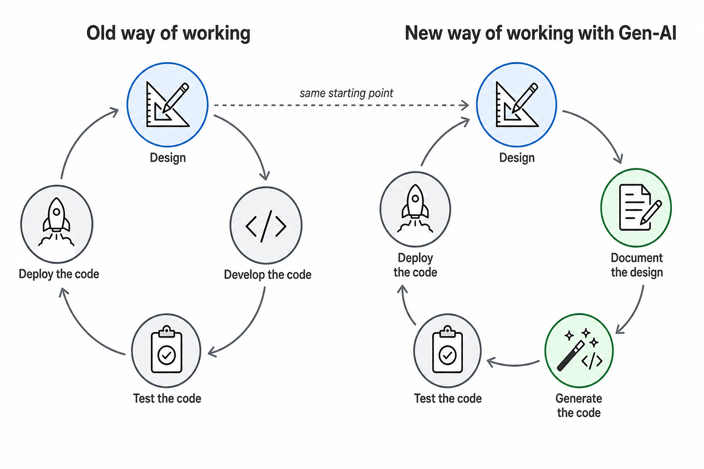

# Data Solution 2026

## Purpose

This is a proof of concept to show how you can use gen-AI to build a state of the art data solution anno 2026 using not only new technology but also a new way of working. 

## Way of working with gen-AI

The CI/CD cycle for a data engineer shifts in two places. **Design** still comes first. What used to be hand-written code becomes generated code, and documentation moves from an afterthought to the input that drives generation.

| Step | Old | New |
| --- | --- | --- |
| 1 | Design | Design *(unchanged)* |
| 2 | Develop the code by hand | **Document the design** — patterns, DSA metadata, decision notes |
| 3 | Test the code | **Generate the code** — Gen-AI drafts from the documented design |
| 4 | Deploy the code | Test the code |
| 5 | — | Deploy the code |

Documentation is no longer optional or trailing—it is the **input** for code generation. The engineer's effort moves from typing implementation to designing well and writing it down so both humans and the AI agent can act on it.

### The role of documentation

Documentation captures design decisions and the knowledge needed to understand the data solution and the data itself. That knowledge is exchanged with other data engineers and with users of the solution.

Traditionally, producing and keeping that material current was labor-intensive work that teams postponed while they focused on getting the pipeline running. Architects usually documented the starting architecture well, but detailed design decisions and implementation choices were deferred; under delivery pressure, documentation stayed incomplete or out of date.

Generative AI shifts that balance in two ways:

1. **Easier to produce** — AI can draft and refresh documentation quickly, so maintenance is no longer the bottleneck it was.
2. **Essential for steering AI** — Up-to-date docs become context for the next change; without them, generated code drifts from intent.

**Before:** Documentation lagged behind delivery: strong at kick-off, thin on detail, and often never finished.

**After:** Start every change by updating documentation, then implement. AI drafts the material quickly so you can review intent before code lands. Documentation and release notes can stay current on each pull request, failed approaches can be recorded for the next session, and prior docs feed the next AI session—documentation becomes part of small CI/CD iterations instead of a separate phase.

### The need to describe functionality

If you want your AI agent to understand what the data solution does, it is important to describe this in a way that is unambiguous and easy to read for an AI agent. The role of the data engineer or data solution designer is to define concepts that describe the data solution well. Design patterns can be used to define industry best practices in a generic way, so that everybody can contribute and fall back on these generic building blocks instead of having to define it again for every solution. 
