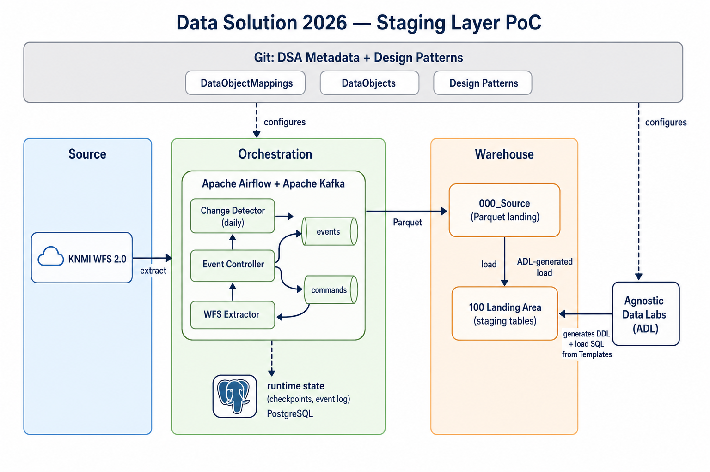

# Data Solution 2026

## Table of contents

<!-- markdown-toc:start -->
- [Purpose](#purpose)
- [Proof of concept](#proof-of-concept)
  - [Architecture](#architecture)
  - [Lessons learned](#lessons-learned)
    - [Data extraction via API](#data-extraction-via-api)
    - [Learning new tools](#learning-new-tools)
    - [Design patterns](#design-patterns)
    - [Consolidating best practices](#consolidating-best-practices)
<!-- markdown-toc:end -->

> [!WARNING]
> **This project is under construction** Please check back later, or turn on [GitHub notifications].

## Purpose

Proof of concept for the way of working as described in [data-engineering-2026](https://github.com/basvdberg/data-engineering-2026).

## Proof of concept

To explore this new way of working, this POC implements a Staging layer for a public data source: Dutch weather data (KNMI)using a free public accessible Api. I use ADL to visualize the transformations and lineage (this is the reason that we have a certain fixed folder structure for this repo. This is used by ADL to categorize the metadata). 

The Python extraction code is fully generated via GenAI. For the orchestration, I started by describing the design patterns that I want to use in the repository [data-engineering-design-patterns](https://github.com/basvdberg/data-engineering-design-patterns). I also used AI to pick suitable tools for my use case, which led to the open-source combination of Apache Airflow and Apache Kafka.

### Architecture

The flow, left to right:

1. **Git holds the configuration.** `DataObjectMappings/000_Source/KNMI/` describes the WFS source; `DataObjects/100_Landing_Area/` and `DataObjectMappings/Staging/` describe the staging tables and the load. Design patterns set the shape of the orchestration.
2. **Airflow + Kafka run the ingestion.** The change-detector DAG polls the WFS service on schedule and emits a `source_change` event when the dataset has new data. The event controller turns matching events into `extract` commands. The WFS extractor consumes commands, calls the source, and writes Parquet to `Data/000_Source/`. PostgreSQL stores checkpoints and the event log only—no configuration.
3. **ADL generates staging artefacts.** Reading the same DSA metadata, ADL renders the Handlebars templates in `Templates/` into DDL and load SQL under `Output/`, which load the Parquet landing files into the **100 Landing Area**.

This solution follows the [separate what and how](https://github.com/basvdberg/data-engineering-design-patterns/blob/main/design-patterns/separate-what-and-how.md) design pattern: the DSA metadata files specify *what* must happen for each source and target, while the Airflow DAGs, the WFS extractor, and the ADL-generated load procedures are the implementation that specifies *how* it is executed.

### Lessons learned

#### Data extraction via API

**Before:** Extracting from a source with a well-defined API typically took one to two weeks—collecting and reading sometimes incomplete documentation, then iteratively building and testing the client.

**After:** With generative AI (Cursor in this project), extraction code for OData and WFS was produced in a handful of prompts. End-to-end validation, including a smoke test against the live service, fit within about an hour.

**Takeaway:** A large efficiency gain, and in this PoC the generated client code was stronger and faster to test than a typical hand-written first version.

#### Learning new tools

**Before:** Learning Airflow, Kafka, ADL, or a new protocol client is normal work, but it often costs weeks of courses and trial-and-error before you ship confidently.

**After:** AI explains how a tool fits a concrete use case in *your* architecture and generates starter code (DAGs, parsers, mapping JSON). You learn from working examples without mastering every aspect of the tool first. That shortens time-to-market for new tooling, makes it easier to compare or replace components, and supports a more technology-agnostic architecture.

#### Design patterns

**Before:** "How we build data pipelines" is often encoded in whichever stack the team already runs; changing tools means re-discovering the same ideas under new names.

**After:** Generative AI pairs naturally with explicit design patterns (such as [event-based orchestration](https://github.com/basvdberg/data-engineering-design-patterns/blob/main/design-patterns/event-based-orchestration.md)): patterns state *what* must happen and abstract away vendor details. Benefits of this approach:

- **Longer solution lifetime** — patterns outlive implementations.
- **Better tool selection** — requirements and patterns can guide AI (and humans) toward fitting technology.
- **Portable best practices** — industry norms can be expressed once and reused regardless of Kafka, Airflow, or the next orchestrator.

#### Consolidating best practices

**Before:** Best practices live in personal notes, scattered wiki pages, and oral tradition; new joiners and AI assistants lack one authoritative, diffable source.

**After:** This repo plus the companion [data-engineering-design-patterns](https://github.com/basvdberg/data-engineering-design-patterns) collection give a shared, version-controlled baseline. Metadata (DSA), generated artefacts (ADL), and pattern docs align so humans and AI apply the same rules on every change.

## Project structure

<!-- markdown-project-structure:start -->
- [Data Solution 2026](readme.md)
  - Classifications
  - Configurations
  - Connections
    - Sources
  - Conventions
  - Dataobjectmappings
    - 000_Source
      - Knmi
        - Roelant
    - Persistentstaging
    - Staging
  - Dataobjects
    - 000_Source
      - Dbo
    - 100_Landing_Area
      - Dbo
    - 150_Persistent_Staging_Area
      - Dbo
  - Docs
    - [Markdown automation](docs/markdown-automation.md)
  - Extractors
    - Common
    - Odata
    - Wfs
  - Perspectives
  - Schemas
    - [Schema follow-ups](Schemas/follow-ups.md)
  - Settings
  - Templates
    - Dataobjectmappinglists
      - [Landing Area Stored Procedure Delta](Templates/DataObjectMappingLists/LandingSqlServerStoredProcedureDelta.handlebars.md)
      - [Landing Area Stored Procedure Landing](Templates/DataObjectMappingLists/LandingSqlServerStoredProcedureLanding.handlebars.md)
      - [Persistent Staging Area Stored Procedure Delta](Templates/DataObjectMappingLists/PersistentStagingSqlServerStoredProcedureDelta.handlebars.md)
      - [Persistent Staging Area Stored Procedure Full Outer Join](Templates/DataObjectMappingLists/PersistentStagingSqlServerStoredProcedureFullOuterJoin.handlebars.md)
    - Dataobjects
      - [Source Area Generate Table](Templates/DataObjects/CreatePhysicalDataObject.handlebars.md)
      - [Landing Area Generate Table](Templates/DataObjects/LandingSqlServerGenerateTable.handlebars.md)
      - [Persistent Staging Area Generate Table](Templates/DataObjects/PersistentStagingSqlServerGenerateTable.handlebars.md)
      - [Source Area Generate Table](Templates/DataObjects/SourceSqlServerGenerateTable.handlebars.md)
    - Other
      - [Deployment](Templates/Other/Container.handlebars.md)
      - [Control Framework Registration](Templates/Other/ControlFrameworkRegistration.handlebars.md)
      - [Databases](Templates/Other/Databases.handlebars.md)
      - [Deployment](Templates/Other/Deployment.handlebars.md)
      - [Documentation](Templates/Other/Documentation.handlebars.md)
      - [Readme](Templates/Other/Readme.handlebars.md)
      - [Sample Data - SaveMore Source System](Templates/Other/SampleDataSqlServer.handlebars.md)
  - [Phase one: CBS OData extraction with event-based orchestration](plan1.md)
  - [Phase two: minimal Dutch government OData ingestion with event-based orchestration](plan2.md)
  - [Phase three: JSON-configured Dutch government OData ingestion](plan3.md)
- Related repositories
  - [cursor-config](https://github.com/basvdberg/cursor-config)
  - [Data Engineering 2026](https://github.com/basvdberg/data-engineering-2026)
  - [Data Engineering Design Patterns](https://github.com/basvdberg/data-engineering-design-patterns)
<!-- markdown-project-structure:end -->
