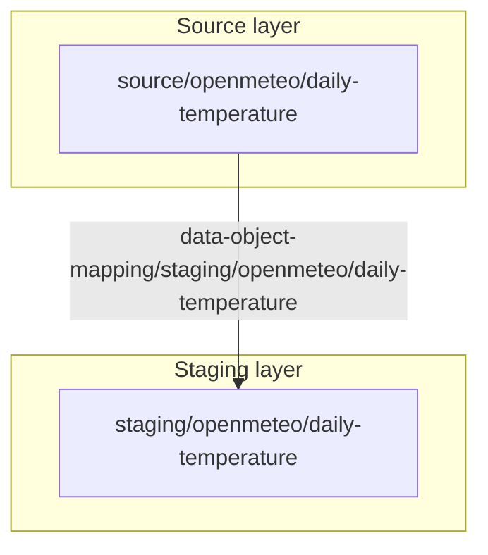
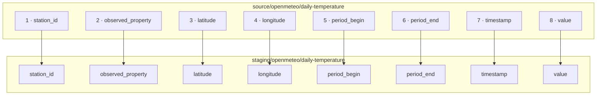

# Data object mapping

## Table of contents

<!-- markdown-toc:start -->
- [Mappings in this project](#mappings-in-this-project)
- [Open-Meteo daily temperature](#open-meteo-daily-temperature)
  - [Object flow](#object-flow)
  - [Data item mappings](#data-item-mappings)
  - [Orchestration](#orchestration)
- [Source files](#source-files)
<!-- markdown-toc:end -->

## Mappings in this project

Documentation for DSA **data object mappings** in this repository. Mappings describe how source data objects become staging targets and how each **data item** (column) maps across layers.

See also the [staging architecture diagram](../../design/architecture-staging.png) and [DSA interface](../../../dsa-interface.md).

| Mapping ID | Source | Target | Status |
|------------|--------|--------|--------|
| `data-object-mapping/staging/openmeteo/daily-temperature` | `source/openmeteo/daily-temperature` | `staging/openmeteo/daily-temperature` | enabled |

All field mappings in this PoC are **one-to-one**: same name and logical type on source and staging. The extractor normalizes the API response into the source-shaped schema; staging files use the same column layout.

## Open-Meteo daily temperature

Daily mean 2 m air temperature for Netherlands reference stations. Source: [Open-Meteo Forecast API](https://open-meteo.com/en/docs).

### Object flow

The solution is organized in **layers**. The diagram keeps only data objects as rectangles; mapping is represented as arrows between objects, with layer context shown in the background.



Each data object carries a `dataConnectionId` (where and how data is reached). It is a property of the object, not a separate flow element.

The mapping file references source and target objects by path. Runtime code (`extractor_and_poller`) loads the mapping and the referenced data objects from Git.

### Data item mappings

Eight **data item mappings** (`id` `1`–`8`). Each maps one source column to the same-named staging column.



| Map id | Source data item | Target data item | Type |
|--------|------------------|------------------|------|
| 1 | `station_id` | `station_id` | string |
| 2 | `observed_property` | `observed_property` | string |
| 3 | `latitude` | `latitude` | double |
| 4 | `longitude` | `longitude` | double |
| 5 | `period_begin` | `period_begin` | string |
| 6 | `period_end` | `period_end` | string |
| 7 | `timestamp` | `timestamp` | string |
| 8 | `value` | `value` | double |

Classification on the mapping: `(trigger, data_object_change)` — the poller emits a change event when this source object’s extraction marker moves.

### Orchestration

```text
Git (mapping + data objects)
  → poller (--mapping daily-temperature) → Kafka (data_object_change)
  → extractor reads source layer, writes staging layer (Parquet)
```

## Source files

| Role | Path |
|------|------|
| Data object mapping | [`data-object-mapping/staging/openmeteo/daily-temperature.json`](../../data-object-mapping/staging/openmeteo/daily-temperature.json) |
| Source data object | [`data-object/source/openmeteo/daily-temperature.json`](../../data-object/source/openmeteo/daily-temperature.json) |
| Staging data object | [`data-object/staging/openmeteo/daily-temperature.json`](../../data-object/staging/openmeteo/daily-temperature.json) |

## Project structure

<!-- markdown-project-structure:start -->
- [Data Solution 2026](../../../readme.md)
  - Code
    - Airflow
      - Dags
    - Extractor_And_Poller
      - Common
      - Openmeteo
        - Extractor
        - Poller
      - Poller
      - Tests
    - Postgres
  - Connection
  - Data
    - Staging
      - Openmeteo
        - Daily_Temperature
  - Data Object
    - Source
      - Openmeteo
    - Staging
      - Openmeteo
  - Data Object Mapping
    - Staging
      - Openmeteo
  - Doc
    - Data Solution
      - Data Object Mapping
    - Design
      - [Architecture](../../design/architecture.md)
      - [CI/CD workflow (main only + server pull deploy)](../../design/ci-cd.md)
      - [Event-based orchestration plan (single data object)](../../design/event-based-orchestration-plan.md)
      - [Meta data design](../../design/meta-data-design.md)
    - [Implementation plan (Open-Meteo → event orchestration)](../../implementation-plan.md)
  - Infra
    - Airflow
      - Dags
    - Kafka
    - Postgres
  - Release
    - Details
      - V2026.06.02.1
      - V2026.06.02.2
      - V2026.06.03.1
      - V2026.06.03.2
      - V2026.06.03.3
      - V2026.06.03.4
      - V2026.06.04.1
      - V2026.06.04.2
      - V2026.06.04.3
      - V2026.06.04.4
      - V2026.06.04.5
      - V2026.06.04.6
      - V2026.06.04.1
      - V2026.06.04.2
      - V2026.06.04.3
      - V2026.06.04.4
      - V2026.06.04.5
      - V2026.06.04.6
    - Notes
      - [Release v2026.06.02.1](../../../release/notes/v2026.06.02.1.md)
      - [Release v2026.06.02.2](../../../release/notes/v2026.06.02.2.md)
      - [Release v2026.06.03.1](../../../release/notes/v2026.06.03.1.md)
      - [Release v2026.06.03.2](../../../release/notes/v2026.06.03.2.md)
      - [Release v2026.06.03.3](../../../release/notes/v2026.06.03.3.md)
      - [Release v2026.06.03.4](../../../release/notes/v2026.06.03.4.md)
      - [V2026.06.04.1](../../../release/notes/v2026.06.04.1.md)
      - [V2026.06.04.2](../../../release/notes/v2026.06.04.2.md)
      - [V2026.06.04.3](../../../release/notes/v2026.06.04.3.md)
      - [V2026.06.04.4](../../../release/notes/v2026.06.04.4.md)
      - [V2026.06.04.5](../../../release/notes/v2026.06.04.5.md)
      - [V2026.06.04.6](../../../release/notes/v2026.06.04.6.md)
    - [Release <version>](../../../release/release-notes-template.md)
  - Setting
  - Template
  - [Getting started](../../../getting-started.md)
  - [Lessons learned](../../../lessons-learned-part1.md)
  - [Lessons learned (part 2)](../../../lessons-learned-part2.md)
- Related repositories
  - [Data Engineering 2026](https://github.com/basvdberg/data-engineering-2026) — Course and learning materials
  - [Data Engineering Design Patterns](https://github.com/basvdberg/data-engineering-design-patterns) — Design pattern catalogue
<!-- markdown-project-structure:end -->
