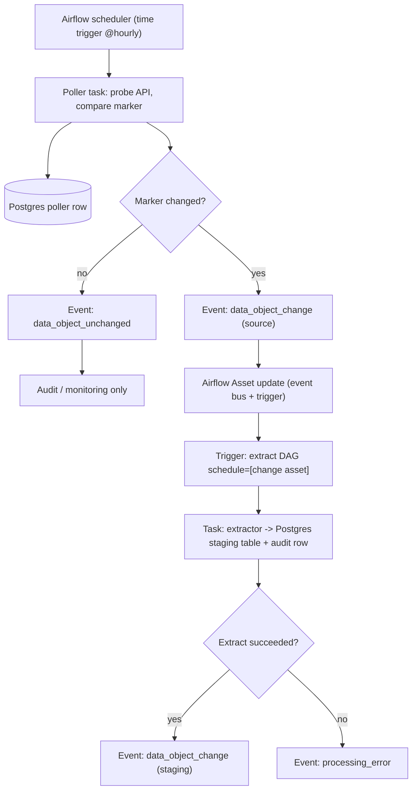

# Event-based orchestration plan

## Table of contents

<!-- markdown-toc:start -->
- [Purpose](#purpose)
- [Flow](#flow)
- [Poller Flow](#poller-flow)
- [Extract Flow](#extract-flow)
- [See also](#see-also)
<!-- markdown-toc:end -->

## Purpose

Implement event-based orchestration design pattern for: `data-object-mapping/staging/openmeteo/daily-temperature`.

Event names follow the [Event-based orchestration](https://github.com/basvdberg/data-engineering-design-patterns/blob/main/design-patterns/data-engineering/event-based-orchestration.md) glossary. This plan instantiates that pattern in Airflow and Postgres.

## Flow

## Poller Flow

1. Airflow schedules poller task (`@hourly` per source `refreshContract`).
2. Poller visits data object public API and gets a current marker.
3. Poller compares current marker to previous marker in Postgres.
4. Poller writes a log entry to Postgres telling whether the data object changed or not. 
5. For triggering dependent task, the Poller emits a change event in Airflow. In Airflow this is done via an Asset change event.

## Extract Flow

1. When a `data_object_change` event is received in Airflow, the dependent tasks are triggered.
2. Extract DAG runs extractor and writes to Postgres.
3. On success, the DAG emits `data_object_change` for the staging data object to Postgres (`extract_run_audit.event_type`) and Airflow (staging change asset). On failure, it emits `processing_error` to Postgres and structured logs; the extract task fails without staging asset emit.

## See also

- [Monitoring architecture](monitoring/monitoring-architecture.md) — operator dashboard design for poll and extract audit events
- [Event orchestration monitoring runbook](../operation/event-orchestration-monitoring.md) — SQL queries and healthy signals

## Project structure

<!-- markdown-project-structure:start -->
- [Data Solution 2026](../../readme.md)
  - Code
    - Airflow
      - Dags
      - Include
      - Plugins
    - Extractor_And_Poller
      - Common
      - Extract
      - Openmeteo
        - Extractor
        - Poller
      - Poller
      - Tests
    - Postgres
      - Migrations
  - Connection
  - Data
    - Staging
      - Openmeteo
        - Daily_Temperature
  - Data Object
    - Source
      - Openmeteo
    - Staging
      - Openmeteo
  - Data Object Mapping
    - Staging
      - Openmeteo
  - Doc
    - Data Object Mapping
    - Design
      - Cicd
        - [CI/CD workflow (main only + server pull deploy)](cicd/ci-cd.md)
      - Monitoring
        - [Monitoring architecture](monitoring/monitoring-architecture.md)
      - [Airflow asset naming](airflow-asset-naming.md)
      - [Event-based orchestration plan](event-based-orchestration-plan.md)
      - [Meta data design](meta-data-design.md)
    - Image
    - Implementation
      - [Implementation plan (Open-Meteo → event orchestration)](../implementation/implementation-plan.md)
    - Linked In
      - [Data object quality of service](../linked-in/data-object-quality-of-service.md)
      - [Linkedin Post Part3V2](../linked-in/linkedin-post-part3v2.md)
    - Operation
      - [Event orchestration monitoring](../operation/event-orchestration-monitoring.md)
    - Retrospective
      - Incident
        - [INC-001 — NAS non-interactive SSH environment](../retrospective/incident/inc-001-nas-ssh-environment.md)
        - [INC-002 — Airflow standalone infra instability](../retrospective/incident/inc-002-airflow-infra-stability.md)
        - [INC-003 — Agent rediscovery and false-done verification](../retrospective/incident/inc-003-agent-process-gaps.md)
        - [INC-004 — Airflow PYTHONPATH drift (dag_run_guard import)](../retrospective/incident/inc-004-airflow-pythonpath-drift.md)
        - [INC-<NNN> — <short title>](../retrospective/incident/incident-template.md)
      - [Issue categories](../retrospective/issue-category.md)
    - [Implementation plan](../implementation-plan.md)
  - Infra
    - Airflow
      - Dags
    - Kafka
    - Postgres
  - Release
    - 2026
      - 06
        - 02
          - V2026.06.02.1
            - [Notes](../../release/2026/06/02/v2026.06.02.1/notes.md)
          - V2026.06.02.2
            - [Release v2026.06.02.2](../../release/2026/06/02/v2026.06.02.2/notes.md)
        - 03
          - V2026.06.03.1
            - [Release v2026.06.03.1](../../release/2026/06/03/v2026.06.03.1/notes.md)
          - V2026.06.03.2
            - [Release v2026.06.03.2](../../release/2026/06/03/v2026.06.03.2/notes.md)
          - V2026.06.03.3
            - [Release v2026.06.03.3](../../release/2026/06/03/v2026.06.03.3/notes.md)
          - V2026.06.03.4
            - [Release v2026.06.03.4](../../release/2026/06/03/v2026.06.03.4/notes.md)
            - [Retrospective](../../release/2026/06/03/v2026.06.03.4/retrospective.md)
        - 04
          - V2026.06.04.1
            - [Notes](../../release/2026/06/04/v2026.06.04.1/notes.md)
        - 05
          - V2026.06.05.6
            - [Notes](../../release/2026/06/05/v2026.06.05.6/notes.md)
            - [Retrospective](../../release/2026/06/05/v2026.06.05.6/retrospective.md)
        - 12
          - V2026.06.12.1
            - [Release v2026.06.12.1](../../release/2026/06/12/v2026.06.12.1/notes.md)
    - [Release <version>](../../release/release-notes-template.md)
    - [Retrospective — <version>](../../release/retrospective-template.md)
  - Schema
  - [Getting started](../../getting-started.md)
  - [Lessons learned](../../lessons-learned-part1.md)
  - [Lessons learned (part 2)](../../lessons-learned-part2.md)
  - [Lessons learned (part 3)](../../lessons-learned-part3.md)
- Related repositories
  - [Data Engineering 2026](https://github.com/basvdberg/data-engineering-2026) — Course and learning materials
  - [Data Engineering Design Patterns](https://github.com/basvdberg/data-engineering-design-patterns) — Design pattern catalogue
<!-- markdown-project-structure:end -->
