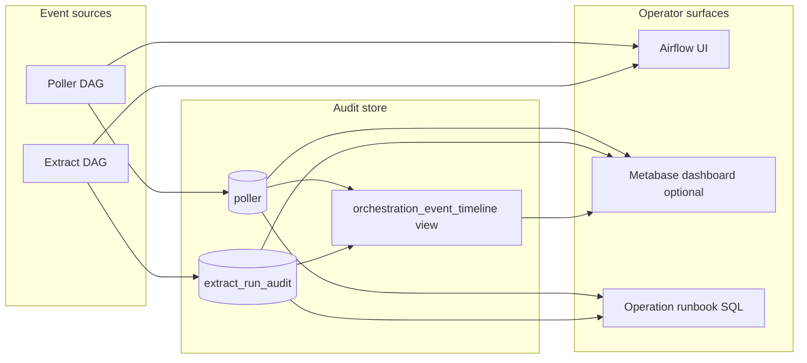

# Monitoring architecture

## Table of contents

<!-- markdown-toc:start -->
- [Purpose](#purpose)
- [Operator questions](#operator-questions)
- [Architecture overview](#architecture-overview)
- [Data model](#data-model)
  - [Existing tables](#existing-tables)
  - [Proposed view: orchestration_event_timeline](#proposed-view-orchestration_event_timeline)
- [Tooling proposal](#tooling-proposal)
  - [Phase 0 — Airflow UI and Postgres SQL](#phase-0-airflow-ui-and-postgres-sql)
  - [Phase 1 — Saved SQL queries](#phase-1-saved-sql-queries)
  - [Phase 2 — Metabase dashboard (recommended)](#phase-2-metabase-dashboard-recommended)
  - [Not recommended](#not-recommended)
- [Dashboard layout](#dashboard-layout)
- [Alerting](#alerting)
- [Related docs](#related-docs)
- [Out of scope](#out-of-scope)
<!-- markdown-toc:end -->

## Purpose

Provide a user-friendly view of **what happened** in the event-based orchestrator: poll outcomes, source changes, extract results, and failures. Operators should answer status questions without reading task logs or tracing Airflow internals.

Event names follow the [Event-based orchestration](https://github.com/basvdberg/data-engineering-design-patterns/blob/main/design-patterns/data-engineering/event-based-orchestration.md) glossary. This document describes the **architecture** for monitoring surfaces; step-by-step troubleshooting lives in the [Event orchestration monitoring runbook](../../operation/event-orchestration-monitoring.md).

## Operator questions

| Question | Event / signal | Primary source |
|----------|----------------|----------------|
| Is polling healthy? | Hourly runs; mostly `data_object_unchanged` | `poller` table; poller DAG run notes |
| Did the source data change? | `data_object_change` with marker move | `poller.new_marker`, `poller.old_marker` |
| Was extract triggered and did it succeed? | Extract row with `event_type=data_object_change`, `status=success` | `extract_run_audit` |
| What failed and where do I drill in? | `processing_error` or `status=failed` | `extract_run_audit`; Airflow task logs |

**Design principle:** Postgres audit rows are the source of truth for *what happened*. Airflow UI is the source of truth for *why a task failed*. Correlate poll and extract rows with `event_id`.

## Architecture overview



Flow context: [Event-based orchestration plan](../event-based-orchestration-plan.md). Poll and extract DAGs write audit rows on every run; Airflow Assets carry change signals between DAGs.

## Data model

Canonical DDL: [`code/postgres/schema.sql`](../../../code/postgres/schema.sql).

### Existing tables

**`public.poller`** — one row per probe.

| Column | Purpose |
|--------|---------|
| `polled_at_utc` | When the probe ran |
| `data_object_id` | Source data object id |
| `event_type` | `data_object_unchanged` or `data_object_change` |
| `change_scope` | e.g. `full_rewrite` |
| `old_marker`, `new_marker` | Marker comparison |
| `event_id` | Correlation id (links to extract) |
| `run_id` | Poller run id |

**`public.poller_latest_first`** — view over `poller`, newest first (for ad-hoc browse).

**`public.extract_run_audit`** — one row per extract attempt.

| Column | Purpose |
|--------|---------|
| `event_id` | Links to poller row on source change |
| `data_object_id` | Staging data object id |
| `event_type` | `data_object_change`, `processing_error`, or null while running |
| `status` | `running`, `success`, `failed` |
| `marker` | Observation day / marker extracted |
| `started_at_utc`, `finished_at_utc` | Extract lifecycle |
| `row_count`, `output_table` | Load outcome |

### Proposed view: orchestration_event_timeline

Optional follow-up migration — not implemented yet. Gives dashboard tools a single timeline table without parsing logs.

| Column | Source |
|--------|--------|
| `occurred_at_utc` | `polled_at_utc` or `finished_at_utc` |
| `stage` | `poll` or `extract` |
| `event_type` | Glossary event name |
| `data_object_id` | Source or staging id |
| `marker` | `new_marker` or `marker` |
| `status` | Extract status, or `ok` for poll |
| `event_id` | Correlation id |
| `detail` | e.g. `row_count`, `old_marker → new_marker` |

Example sketch (design only):

```sql
-- orchestration_event_timeline — design sketch, not applied
select
    polled_at_utc as occurred_at_utc,
    'poll' as stage,
    event_type,
    data_object_id,
    new_marker as marker,
    'ok' as status,
    event_id,
    coalesce(old_marker || ' → ' || new_marker, new_marker) as detail
from poller
union all
select
    coalesce(finished_at_utc, started_at_utc) as occurred_at_utc,
    'extract' as stage,
    event_type,
    data_object_id,
    marker,
    status,
    event_id,
    case when row_count is not null then 'rows=' || row_count::text else null end as detail
from extract_run_audit
order by occurred_at_utc desc;
```

## Tooling proposal

Prefer simplicity: reuse what is already deployed on BasNAS before adding new containers.

| Phase | Tooling | Role |
|-------|---------|------|
| **0 — now** | Airflow UI + Postgres SQL | Workflow health and event audit |
| **1 — low effort** | pgAdmin or `psql` + saved queries | Browse audit tables with zero new infra |
| **2 — recommended** | Metabase (single Docker container) | Operator-friendly dashboard on Postgres |

### Phase 0 — Airflow UI and Postgres SQL

Already deployed. Use for:

- **DAG grid** — hourly poller runs; extract runs on asset change
- **DAG run notes** — poller summary: `changed | postgres:<event_type> | api:ok`
- **Task logs** — probe, extract, and summary key=value lines
- **Assets view** — source and staging change asset updates

Runbook SQL: [Event orchestration monitoring](../../operation/event-orchestration-monitoring.md).

### Phase 1 — Saved SQL queries

No new services. Query `poller_latest_first` and `extract_run_audit` via pgAdmin or `psql` against the shared Postgres instance (`basnas_postgress:5432`, database `data-solution-2026`). Matches the browse intent noted in [`schema.sql`](../../../code/postgres/schema.sql).

### Phase 2 — Metabase dashboard (recommended)

Add Metabase when operators want a dedicated dashboard URL. Reads existing Postgres tables only; no schema change required (the optional timeline view improves UX).

Deployment sketch (future work):

- One service under `infra/` connecting to existing Postgres
- Read-only DB user for Metabase (extend pattern in [`grant-app-user.sql`](../../../code/postgres/grant-app-user.sql))
- Reverse proxy URL alongside Airflow (e.g. `https://monitoring.basnas/`)

Why Metabase over alternatives: SQL-native, low setup, good for non-engineers charting audit tables. No log parsing or metrics pipeline needed.

### Not recommended

| Option | Reason |
|--------|--------|
| Grafana + Loki/Prometheus | Overkill for PoC; audit tables are richer than task logs |
| Kafka / custom event bus UI | Removed from stack; Airflow Assets + Postgres replace it |
| Airflow UI alone | Good for drill-down, not a substitute for an event timeline |

Airflow Assets and the DAG grid remain useful complements for trigger-chain visibility.

## Dashboard layout

Four panels for Metabase (or equivalent SQL client):

1. **Health summary** — last poll time, last extract time, current marker, count of `processing_error` in last 7 days
2. **Event timeline** — table from `orchestration_event_timeline` or joined query, filterable by `data_object_id`
3. **End-to-end trace** — for a selected `event_id`: poll row → extract row → latency (`finished_at_utc - polled_at_utc`)
4. **Failures** — rows where `event_type = processing_error` or `status = failed`, with marker and mapping id

Drill-down: open the matching Airflow DAG run for task logs (manual step today; optional future: construct Airflow URL from `run_id` in a view).

## Alerting

Keep alerts minimal:

| Alert | Condition |
|-------|-----------|
| Stale poll | No `poller` row for source data object in > 2 hours |
| Orphan change | `data_object_change` in `poller` without matching extract success within N hours (same `event_id`) |
| Repeated failure | 3+ `processing_error` rows for the same marker |

Implementation options (defer): Metabase alerts, Airflow email on task failure (native), or a small scheduled SQL-check DAG.

## Related docs

| Doc | Role |
|-----|------|
| [Event orchestration monitoring runbook](../../operation/event-orchestration-monitoring.md) | Operational procedures and SQL queries |
| [Event-based orchestration plan](../event-based-orchestration-plan.md) | Orchestration flow and event emit points |
| [Airflow readme](../../../code/airflow/readme.md) | DAG and asset reference |
| [Airflow asset naming](../airflow-asset-naming.md) | Change asset URIs |

## Out of scope

- Implementing Metabase compose or SQL migrations in this design
- Parsing Airflow task logs into a dashboard
- Reintroducing Kafka
- Generalising beyond the current Open-Meteo PoC (noted as future extension when more data objects are added)

## Project structure

<!-- markdown-project-structure:start -->
- [Data Solution 2026](../../../readme.md)
  - Code
    - Airflow
      - Dags
      - Include
      - Plugins
    - Extractor_And_Poller
      - Common
      - Extract
      - Openmeteo
        - Extractor
        - Poller
      - Poller
      - Tests
    - Postgres
      - Migrations
  - Connection
  - Data
    - Staging
      - Openmeteo
        - Daily_Temperature
  - Data Object
    - Source
      - Openmeteo
    - Staging
      - Openmeteo
  - Data Object Mapping
    - Staging
      - Openmeteo
  - Doc
    - Data Object Mapping
    - Design
      - Cicd
        - [CI/CD workflow (main only + server pull deploy)](../cicd/ci-cd.md)
      - Monitoring
        - [Monitoring architecture](monitoring-architecture.md)
      - [Airflow asset naming](../airflow-asset-naming.md)
      - [Event-based orchestration plan](../event-based-orchestration-plan.md)
      - [Meta data design](../meta-data-design.md)
    - Image
    - Implementation
      - [Implementation plan (Open-Meteo → event orchestration)](../../implementation/implementation-plan.md)
    - Linked In
      - [Linkedin Post Part3V2](../../linked-in/linkedin-post-part3v2.md)
    - Operation
      - [Event orchestration monitoring](../../operation/event-orchestration-monitoring.md)
    - Retrospective
      - Incident
        - [INC-001 — NAS non-interactive SSH environment](../../retrospective/incident/inc-001-nas-ssh-environment.md)
        - [INC-002 — Airflow standalone infra instability](../../retrospective/incident/inc-002-airflow-infra-stability.md)
        - [INC-003 — Agent rediscovery and false-done verification](../../retrospective/incident/inc-003-agent-process-gaps.md)
        - [INC-004 — Airflow PYTHONPATH drift (dag_run_guard import)](../../retrospective/incident/inc-004-airflow-pythonpath-drift.md)
        - [INC-<NNN> — <short title>](../../retrospective/incident/incident-template.md)
      - [Issue categories](../../retrospective/issue-category.md)
    - [Implementation plan](../../implementation-plan.md)
  - Infra
    - Airflow
      - Dags
    - Kafka
    - Postgres
  - Release
    - 2026
      - 06
        - 02
          - V2026.06.02.1
            - [Notes](../../../release/2026/06/02/v2026.06.02.1/notes.md)
          - V2026.06.02.2
            - [Release v2026.06.02.2](../../../release/2026/06/02/v2026.06.02.2/notes.md)
        - 03
          - V2026.06.03.1
            - [Release v2026.06.03.1](../../../release/2026/06/03/v2026.06.03.1/notes.md)
          - V2026.06.03.2
            - [Release v2026.06.03.2](../../../release/2026/06/03/v2026.06.03.2/notes.md)
          - V2026.06.03.3
            - [Release v2026.06.03.3](../../../release/2026/06/03/v2026.06.03.3/notes.md)
          - V2026.06.03.4
            - [Release v2026.06.03.4](../../../release/2026/06/03/v2026.06.03.4/notes.md)
            - [Retrospective](../../../release/2026/06/03/v2026.06.03.4/retrospective.md)
        - 04
          - V2026.06.04.1
            - [Notes](../../../release/2026/06/04/v2026.06.04.1/notes.md)
        - 05
          - V2026.06.05.6
            - [Notes](../../../release/2026/06/05/v2026.06.05.6/notes.md)
            - [Retrospective](../../../release/2026/06/05/v2026.06.05.6/retrospective.md)
        - 12
          - V2026.06.12.1
            - [Release v2026.06.12.1](../../../release/2026/06/12/v2026.06.12.1/notes.md)
    - [Release <version>](../../../release/release-notes-template.md)
    - [Retrospective — <version>](../../../release/retrospective-template.md)
  - Schema
  - [Getting started](../../../getting-started.md)
  - [Lessons learned](../../../lessons-learned-part1.md)
  - [Lessons learned (part 2)](../../../lessons-learned-part2.md)
  - [Lessons learned (part 3)](../../../lessons-learned-part3.md)
- Related repositories
  - [Data Engineering 2026](https://github.com/basvdberg/data-engineering-2026) — Course and learning materials
  - [Data Engineering Design Patterns](https://github.com/basvdberg/data-engineering-design-patterns) — Design pattern catalogue
<!-- markdown-project-structure:end -->
