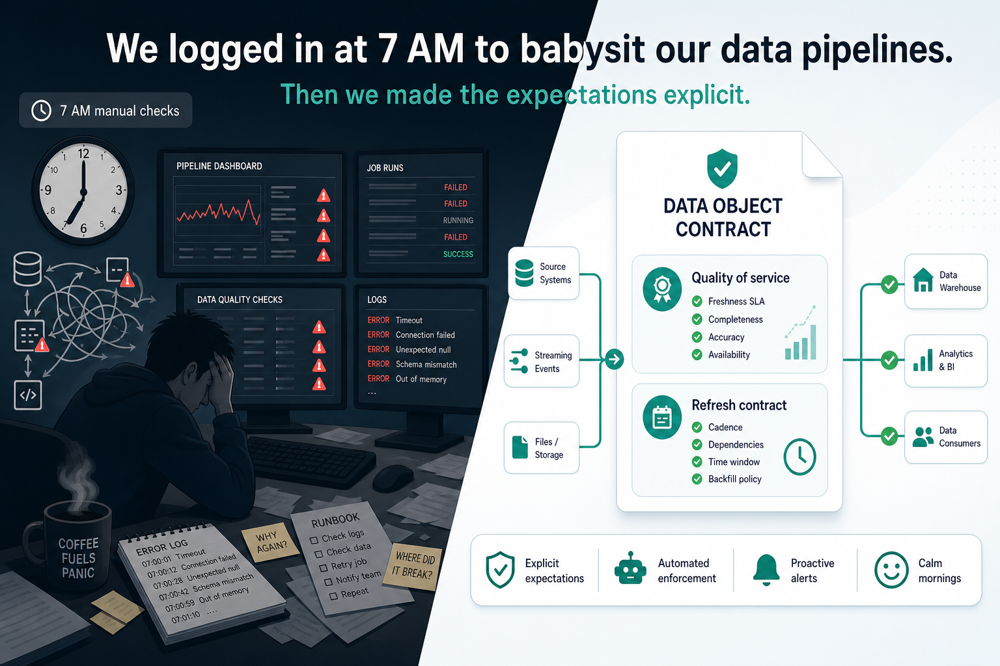

# Data Object Contract

## Table of contents

<!-- markdown-toc:start -->
- [Purpose](#purpose)
- [References](#references)
- [Related patterns](#related-patterns)
<!-- markdown-toc:end -->

## Purpose

Working with AI forces you to make tacit knowledge explicit. This exercise can be quite complex, but also very rewarding as I will show in this post. 
A concrete example: the scheduling and monitoring expectations for your data pipelines.

In my latest assignment, my team had a morning monitoring routine. We logged in early to verify that all mandatory sources were loaded before the business day started — so missing data would not impact operations. It worked, but it required a lot of manual checks across dashboards, logs, and upstream systems.

As data engineers we automate repetitive work. We tried to automate this routine too. We made progress, but we did not fully succeed — because the job is more complex than expected.

For example: chasing another team to fix a source-side issue, or deciding whether downstream jobs should continue with partial data.
I think most of this manual work can disappear if we fully specify expectations and automatically communicate deviations from them.

The fix is a **data object contract** for each object — one reviewable specification with two halves.

The first half is what consumers can rely on (quality of service):

- **Freshness** — how often data is updated and how soon it is available after creation at the source
- **Availability** — whether consumers can reach the data, and when it is supported or retired
- **Service levels** — time to detect, notify, and repair when delivery falls short

The second half is how the producer actually refreshes the object (the refresh contract):

- **Trigger** — start on a clock time, when upstream data is ready, or both
- **Extract window & access mode** — when the source may be read, and whether consumers read it live or from a published snapshot
- **Scope & snapshot time** — full, partition, or subset, and the exact moment the data was captured
- **Arrival & backfill windows** — when the refreshed object is expected, and how late-arriving data is reprocessed

The two halves are deliberately linked: refresh mechanics must support the promised quality. Arrival windows — and the latency that accumulates along a dependency chain — must fit inside the freshness consumers were promised. That alignment is what turns the contract from a document into something operations can enforce.

I captured this as a design pattern in the Data Engineering Design Patterns collection (see Related patterns below).

Making expectations explicit is not paperwork — it is what lets automation replace the morning routine.

#DataEngineering #DataQuality #DataArchitecture #DesignPatterns #DataOps

## References

- Nichols, K., Blake, S., Baker, F., & Black, D. (1998). *RFC 2475: An Architecture for Differentiated Services*. Internet Engineering Task Force. https://www.rfc-editor.org/rfc/rfc2475 — Networking QoS model adapted for data freshness, availability, and delivery reliability.

- Bitol. (2024). *Open Data Contract Standard v3.1.0: Service level agreement*. Linux Foundation. https://bitol-io.github.io/open-data-contract-standard/v3.1.0/service-level-agreement/ — Producer–consumer SLA vocabulary for per-object freshness and service-level expectations.

## Related patterns

- [Data object contract](https://github.com/basvdberg/data-engineering-design-patterns/blob/main/design-patterns/data-engineering/data-object-contract.md) — the umbrella that pairs quality of service with a refresh contract and aligns the two.
- [Data object quality of service](https://github.com/basvdberg/data-engineering-design-patterns/blob/main/design-patterns/data-engineering/data-object-quality-of-service.md) — design pattern for the metrics declared in this post.
- [Data object refresh contract](https://github.com/basvdberg/data-engineering-design-patterns/blob/main/design-patterns/data-engineering/data-object-refresh-contract.md) — producer refresh mechanics: when and how each object is refreshed.
- [Event-based orchestration](https://github.com/basvdberg/data-engineering-design-patterns/blob/main/design-patterns/data-engineering/event-based-orchestration.md) — dependency-driven execution when upstream data is ready.

## Project structure

<!-- markdown-project-structure:start -->
- [Data Solution 2026](../../readme.md)
  - Code
    - Airflow
      - Dags
      - Include
      - Plugins
    - Extractor_And_Poller
      - Common
      - Extract
      - Openmeteo
        - Extractor
        - Poller
      - Poller
      - Tests
    - Postgres
      - Migrations
  - Connection
  - Data
    - Staging
      - Openmeteo
        - Daily_Temperature
  - Data Object
    - Source
      - Openmeteo
    - Staging
      - Openmeteo
  - Data Object Mapping
    - Staging
      - Openmeteo
  - Doc
    - Data Object Mapping
    - Design
      - Cicd
        - [CI/CD workflow (main only + server pull deploy)](../design/cicd/ci-cd.md)
      - Monitoring
        - [Monitoring architecture](../design/monitoring/monitoring-architecture.md)
      - [Airflow asset naming](../design/airflow-asset-naming.md)
      - [Event-based orchestration plan](../design/event-based-orchestration-plan.md)
      - [Meta data design](../design/meta-data-design.md)
    - Image
    - Implementation
      - [Implementation plan (Open-Meteo → event orchestration)](../implementation/implementation-plan.md)
    - Linked In
      - [Data Object Contract](data-object-contract.md)
      - [Linkedin Post Part3V2](linkedin-post-part3v2.md)
    - Operation
      - [Event orchestration monitoring](../operation/event-orchestration-monitoring.md)
    - Retrospective
      - Incident
        - [INC-001 — NAS non-interactive SSH environment](../retrospective/incident/inc-001-nas-ssh-environment.md)
        - [INC-002 — Airflow standalone infra instability](../retrospective/incident/inc-002-airflow-infra-stability.md)
        - [INC-003 — Agent rediscovery and false-done verification](../retrospective/incident/inc-003-agent-process-gaps.md)
        - [INC-004 — Airflow PYTHONPATH drift (dag_run_guard import)](../retrospective/incident/inc-004-airflow-pythonpath-drift.md)
        - [INC-<NNN> — <short title>](../retrospective/incident/incident-template.md)
      - [Issue categories](../retrospective/issue-category.md)
    - [Implementation plan](../implementation-plan.md)
  - Infra
    - Airflow
      - Dags
    - Kafka
    - Postgres
  - Release
    - 2026
      - 06
        - 02
          - V2026.06.02.1
            - [Notes](../../release/2026/06/02/v2026.06.02.1/notes.md)
          - V2026.06.02.2
            - [Release v2026.06.02.2](../../release/2026/06/02/v2026.06.02.2/notes.md)
        - 03
          - V2026.06.03.1
            - [Release v2026.06.03.1](../../release/2026/06/03/v2026.06.03.1/notes.md)
          - V2026.06.03.2
            - [Release v2026.06.03.2](../../release/2026/06/03/v2026.06.03.2/notes.md)
          - V2026.06.03.3
            - [Release v2026.06.03.3](../../release/2026/06/03/v2026.06.03.3/notes.md)
          - V2026.06.03.4
            - [Release v2026.06.03.4](../../release/2026/06/03/v2026.06.03.4/notes.md)
            - [Retrospective](../../release/2026/06/03/v2026.06.03.4/retrospective.md)
        - 04
          - V2026.06.04.1
            - [Notes](../../release/2026/06/04/v2026.06.04.1/notes.md)
        - 05
          - V2026.06.05.6
            - [Notes](../../release/2026/06/05/v2026.06.05.6/notes.md)
            - [Retrospective](../../release/2026/06/05/v2026.06.05.6/retrospective.md)
        - 12
          - V2026.06.12.1
            - [Release v2026.06.12.1](../../release/2026/06/12/v2026.06.12.1/notes.md)
    - [Release <version>](../../release/release-notes-template.md)
    - [Retrospective — <version>](../../release/retrospective-template.md)
  - Schema
  - [Getting started](../../getting-started.md)
  - [Lessons learned](../../lessons-learned-part1.md)
  - [Lessons learned (part 2)](../../lessons-learned-part2.md)
  - [Lessons learned (part 3)](../../lessons-learned-part3.md)
- Related repositories
  - [Data Engineering 2026](https://github.com/basvdberg/data-engineering-2026) — Course and learning materials
  - [Data Engineering Design Patterns](https://github.com/basvdberg/data-engineering-design-patterns) — Design pattern catalogue
<!-- markdown-project-structure:end -->
