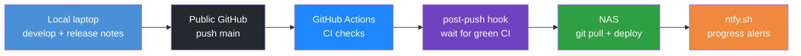

# Lessons learned (part 2)

## Table of contents

<!-- markdown-toc:start -->
- [Purpose](#purpose)
- [Working with agents](#working-with-agents)
- [Junior-programmer mistakes](#junior-programmer-mistakes)
- [Infrastructure deployment](#infrastructure-deployment)
- [Remote SSH troubleshooting](#remote-ssh-troubleshooting)
- [Agent troubleshooting efficiency](#agent-troubleshooting-efficiency)
- [Learning new tools](#learning-new-tools)
- [Design the platform before application code](#design-the-platform-before-application-code)
- [CI/CD process](#cicd-process)
<!-- markdown-toc:end -->

## Purpose

This part of the POC consists of getting our hands dirty with [Apache Airflow](https://airflow.apache.org/). I'll try to not only document what goes well but also what goes wrong because that can be very insightful.

## Working with agents

Working with agents requires a high level of discipline. It is very tempting to trust the agent to do your work for you — to skip the boring design steps and let the next prompt produce something that runs. In this PoC I did not invest enough time in designing the infrastructure up front, which led to several poor decisions (unpinned passwords, identity that breaks on reboot, fix-on-failure instead of reviewed compose). The same pattern showed up in application code when state lived on the local filesystem until a server deploy forced a rethink ([Design the platform before application code](#design-the-platform-before-application-code)).

You cannot expect an agent to automatically follow industry best practices or apply every architectural design principle. It optimises for “works now” in the current session unless you steer it. Best practices and platform decisions must be **enforced by documentation** — architecture notes, CI/CD design, infra checklists, Cursor skills and rules — and by human review before changes land. Part 1’s [Keep Gen AI under control](lessons-learned-part1.md#keep-gen-ai-under-control) is the same idea at artifact scope; part 2 is the same idea at **platform and infra** scope.

**Takeaway:** Treat the agent as a fast implementer, not the architect. Document decisions and constraints first; review diffs; require reboot/restart tests for infra. Discipline is on you, not on the model.

## Junior-programmer mistakes

I use Cursor with **Auto** model selection — not the most capable (or expensive) model on every turn. That is fine for speed and cost, but it showed up clearly in application code: the agent often behaves like a **junior programmer** — fast, plausible, and easy to trust until you check the database.

A concrete example came from getting an Airflow DAG to “work.” After several troubleshooting sessions the task ran green and the logs reported that data had been **successfully written to Postgres**. Only when I queried Postgres did I find **no rows**. The failure was not exotic: the code followed the **happy path** — it logged success as if the write had completed — without checking that the database call actually succeeded (return value, row count, commit, or an error from the driver).

That mistake is basic engineering hygiene. A human reviewer would ask “how do you know it wrote?” The agent optimised for a green task and reassuring log lines, not for **verifiable side effects**. The same pattern appears elsewhere: assume the connection string is right because the client object was created; log “done” at the end of a `try` block without confirming persistence; treat “no exception” as “data landed.”

**Takeaway:** Do not trust success logs from agent-generated code until you **verify the outcome** (query Postgres, inspect the file, check row counts). In prompts and review, require explicit validation — check return codes, assert affected rows, fail the task on mismatch — and treat “DAG succeeded” as unrelated to “data is there” until you have proof.

## Infrastructure deployment

At first, Airflow was not installed correctly. It was missing the metadata database and some other pieces, and logging was not working. It took several prompts to fix this.

The installation was not performed in the best way overall. A concrete example: after almost every infra change, Docker had to be restarted. this generated a **new random admin password** each time — so the UI login kept breaking until I explicitly asked the agent to pin the password. This issue indicates to me that the Agent doesn't, by itself, think about all aspects of infrastructure deployment.

Another example: after every **server reboot** or **Docker restart**, opening the Airflow UI shows a handful of errors (sometimes five, sometimes two) because **internal IP addresses and ports** no longer match what the UI or workers expect. I have prompted several times to stabilise hostnames, published ports, and how Airflow advertises itself to the browser (e.g. log links, worker callbacks). The compose file was updated — fixed admin password, named Docker network, `hostname`, `AIRFLOW__CORE__HOSTNAME_CALLABLE` — but the problem still comes back on reboot. So the “fix” did not hold end-to-end: either something outside that file still changes on restart (Container Station, bridge networking, dynamic worker ports), or the agent addressed symptoms in the UI without verifying a full stop → reboot → browse cycle.

**Takeaway:** For infra, “it works in the browser once” is not enough. Require an explicit test after `docker compose down` / host reboot and treat recurring UI errors as a signal that identity (hostname, IP, port) is still not pinned.

And to be honest, this was probably caused by the fact that I Let the design and architectural choices of my infra configuration be completely up to the agent.

For the next time , I would use a more managed approach: document architectural decisions
and human review before anything is applied. E.g. Specify service levels for an infra-sys system and security design.

## Remote SSH troubleshooting

When the agent troubleshoots on the NAS, it logs in via SSH and runs Docker commands. Those often failed because `docker` was not on `PATH` in non-interactive SSH sessions (the shell gets a minimal `PATH` and does not load `~/.profile`). The agent recovered by looking up where Docker was installed — but it did that **many times** in the same session instead of fixing the environment once.

That pattern suggests the agent does not treat “repeat the same workaround” as an efficiency problem unless you say so. I had to **explicitly** prompt it to fix `PATH` (or source [`infra/scripts/nas-remote-env.sh`](infra/scripts/nas-remote-env.sh), which adds Container Station’s `docker` and other QNAP paths) so later commands could just use `docker`.

**Takeaway:** After the first `command not found` for a tool you will need again, tell the agent to persist the fix for the rest of the session — export `PATH`, source the env script, or add a small helper — and do not accept repeated `which docker` / `find` lookups.

## Agent troubleshooting efficiency

While fixing infra on the NAS, the agent’s **backtracking** (try another command, another path, another workaround until something works) often unblocked the task — but it also **repeated the same faults** in one session: rediscovering where `docker` lives, re-running `which` / `find`, or retrying an approach that had already failed. Part 1 noted that Cursor is good at backtracking until an issue is fixed; part 2 showed that “fixed once” does not mean “remembered for the rest of the session.”

Improving troubleshooting **efficiency** does not seem to be a default goal while the agent is still driving toward a green exit code. Unless you say so, each failed command can be treated like a fresh problem rather than a signal to persist environment fixes or avoid known dead ends.

To make repeats visible and reviewable, I added a Cursor skill **`troubleshooting-error-log`**. It appends structured entries to `.cursor/troubleshooting-errors.md` in the workspace: command, error, short description, solution, **Prevention**, and a **Count** when the same error signature recurs. The agent should **read the log before retrying** and apply documented solutions instead of rediscovering them. When I ask for a review, the skill produces a summary (totals, repeated mistakes, efficiency recommendations) so patterns can become **permanent** fixes — skills, rules, [`infra/scripts/nas-remote-env.sh`](infra/scripts/nas-remote-env.sh), compose pins, and similar.

The NAS `PATH` / `docker` case above is a simple example: log it once with prevention “source `nas-remote-env.sh` at the start of SSH troubleshooting,” and later sessions should not pay for the same lookup loop.

**Takeaway:** Treat agent troubleshooting as a learning loop — log failures, deduplicate repeats, review periodically, and codify prevention in the repo so backtracking moves forward instead of circling the same mistakes.

## Learning new tools

I was new to Airflow and thought it was a visual tool to orchestrate data transformations. It turned out to be a scheduler of tasks where the tasks are defined in Python files stored in a linked folder (the DAGs directory). For my poller and extractor, that fits perfectly because I had already built them in Python.

Beyond generating starter code, the agent often acted as a **mentor**: it explained how Airflow actually behaves (DAG parsing, scheduler vs webserver, log URLs), what a stack trace or UI error likely meant, and what to try next — in the context of *this* PoC on the NAS. Instead of working through long official docs or hunting user forums, I could ask follow-up questions in the same session. That worked well for learning new tools quickly, especially when errors were environment-specific (Docker, SSH, QNAP paths).

**Takeaways:**

- Treat Airflow as a Python-defined task scheduler, not a drag-and-drop ETL designer.
- Use the agent as an on-demand tutor for tool behavior and errors; pair that with docs when you need authoritative reference or edge-case depth.
- For infra, decide early what must survive restarts (passwords, volumes, ports, hostnames) and document it; do not assume the first agent-generated compose file is production-ready.
- PoC: agent-driven install and fix-on-failure is acceptable. Production: design, document, and review infra before deploy.

## Design the platform before application code

Early in this PoC I started generating code for the [extractor and poller](code/extractor_and_poller/readme.md). That felt productive — GenAI can produce a working client quickly (see [part 1](lessons-learned-part1.md#data-extraction-via-api)) — but the first implementation stored **runtime state on the local filesystem** (a folder beside the process). On a laptop that is fine; on the NAS and in scheduled Airflow tasks it is not: containers restart, working directories differ, and multiple runs do not share durable state reliably.

I upgraded poller execution history and markers to **PostgreSQL** ([`code/postgres/schema.sql`](code/postgres/schema.sql), [`poller/state.py`](code/extractor_and_poller/poller/state.py)). That fixed persistence for the server, but it also meant rework: schema, connection config, and deploy steps that could have been decided up front.

The broader lesson is not only “use a database on the server,” but **design the whole platform before writing application code** — even for a PoC:

- **Dev and prod environments** — where processes run, how they reach Postgres, Airflow, and data volumes on the NAS.
- **CI/CD** — versioning, release notes, checks on push, and pull-based deploy to the server (see [CI/CD process](#cicd-process) and [meta data design](doc/design/meta-data-design.md) for Git-held *what* vs runtime *how*).
- **Operational concerns** — secrets, connection strings, migrations, and what must survive restarts.

Had I sketched that first, the extractor and poller could have targeted Postgres (or another shared store) from day one instead of learning it from a broken server deploy.

**Takeaway:** Fast AI-generated application code is tempting; for a PoC that will run on a real server, still **design environments, persistence, and deploy/versioning first**, then generate code against that contract.

## CI/CD process

I designed a CI/CD workflow that keeps release history and prompts in Git, without giving GitHub access to my internal server. Development happens on my local laptop; the public GitHub repo is the source of truth. A pre-commit hook (via [cursor-config](https://github.com/basvdberg/cursor-config)) uses skills and scripts to bump `release/VERSION`, create release notes from the template, sync `release/details/<version>/`, and list all prompts used in that release. After I push to `main`, GitHub Actions runs checks only — deployment is pull-based on the NAS.

A post-push Git hook starts a background watcher that waits until the commit is visible on `origin/main` and CI is green, then SSH-triggers `deploy-on-nas.sh` on the server. Every release is pulled and deployed this way. Progress notifications go through [ntfy.sh](https://ntfy.sh/) (topic `data-solution-2026-deploy`) so I can follow the pipeline from my phone without watching the terminal.

Full design: [CI/CD workflow (main only + server pull deploy)](doc/design/ci-cd.md).

**Takeaway:** Pull-based deploy from a public repo avoids inbound GitHub access to a private NAS; pair it with versioned release notes, automated prompt capture, and lightweight notifications so every release is traceable and hands-off after push.

## Project structure

<!-- markdown-project-structure:start -->
- [Data Solution 2026](readme.md)
  - Code
    - Airflow
      - Dags
      - Plugins
    - Extractor_And_Poller
      - Common
      - Openmeteo
        - Extractor
        - Poller
      - Poller
      - Tests
    - Postgres
  - Connection
  - Data
    - Staging
      - Openmeteo
        - Daily_Temperature
  - Data Object
    - Source
      - Openmeteo
    - Staging
      - Openmeteo
  - Data Object Mapping
    - Staging
      - Openmeteo
  - Doc
    - Data Solution
      - Data Object Mapping
    - Design
      - [Architecture](doc/design/architecture.md)
      - [CI/CD workflow (main only + server pull deploy)](doc/design/ci-cd.md)
      - [Event-based orchestration plan (single data object)](doc/design/event-based-orchestration-plan.md)
      - [Meta data design](doc/design/meta-data-design.md)
    - [Implementation plan (Open-Meteo → event orchestration)](doc/implementation-plan.md)
  - Infra
    - Airflow
      - Dags
    - Kafka
    - Postgres
  - Release
    - Details
      - V2026.06.02.1
      - V2026.06.02.2
      - V2026.06.03.1
      - V2026.06.03.2
      - V2026.06.03.3
      - V2026.06.03.4
      - V2026.06.04.1
      - V2026.06.04.2
      - V2026.06.04.3
      - V2026.06.04.4
      - V2026.06.04.5
      - V2026.06.04.6
      - V2026.06.04.7
      - V2026.06.04.8
      - V2026.06.04.9
      - V2026.06.05.1
      - V2026.06.05.2
      - V2026.06.05.3
      - V2026.06.05.4
      - V2026.06.05.5
    - Notes
      - [Release v2026.06.02.1](release/notes/v2026.06.02.1.md)
      - [Release v2026.06.02.2](release/notes/v2026.06.02.2.md)
      - [Release v2026.06.03.1](release/notes/v2026.06.03.1.md)
      - [Release v2026.06.03.2](release/notes/v2026.06.03.2.md)
      - [Release v2026.06.03.3](release/notes/v2026.06.03.3.md)
      - [Release v2026.06.03.4](release/notes/v2026.06.03.4.md)
      - [V2026.06.04.1](release/notes/v2026.06.04.1.md)
      - [V2026.06.04.2](release/notes/v2026.06.04.2.md)
      - [V2026.06.04.3](release/notes/v2026.06.04.3.md)
      - [V2026.06.04.4](release/notes/v2026.06.04.4.md)
      - [V2026.06.04.5](release/notes/v2026.06.04.5.md)
      - [V2026.06.04.6](release/notes/v2026.06.04.6.md)
      - [V2026.06.04.7](release/notes/v2026.06.04.7.md)
      - [V2026.06.04.8](release/notes/v2026.06.04.8.md)
      - [V2026.06.04.9](release/notes/v2026.06.04.9.md)
      - [V2026.06.05.1](release/notes/v2026.06.05.1.md)
      - [V2026.06.05.2](release/notes/v2026.06.05.2.md)
      - [V2026.06.05.3](release/notes/v2026.06.05.3.md)
      - [V2026.06.05.4](release/notes/v2026.06.05.4.md)
      - [V2026.06.05.5](release/notes/v2026.06.05.5.md)
    - [Release <version>](release/release-notes-template.md)
  - Setting
  - Template
  - [Getting started](getting-started.md)
  - [Lessons learned](lessons-learned-part1.md)
  - [Lessons learned (part 2)](lessons-learned-part2.md)
- Related repositories
  - [Data Engineering 2026](https://github.com/basvdberg/data-engineering-2026) — Course and learning materials
  - [Data Engineering Design Patterns](https://github.com/basvdberg/data-engineering-design-patterns) — Design pattern catalogue
<!-- markdown-project-structure:end -->
