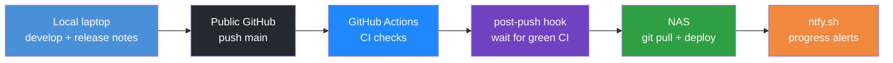

# Lessons learned (part 2)

## Table of contents

<!-- markdown-toc:start -->
- [Purpose](#purpose)
- [Infrastructure deployment](#infrastructure-deployment)
- [Remote SSH troubleshooting](#remote-ssh-troubleshooting)
- [Learning new tools](#learning-new-tools)
- [CI/CD process](#cicd-process)
<!-- markdown-toc:end -->

## Purpose

This part of the POC consists of getting our hands dirty with [Apache Airflow](https://airflow.apache.org/). I'll try to not only document what goes well but also what goes wrong because that can be very insightful.

## Infrastructure deployment

At first, Airflow was not installed correctly. It was missing the metadata database and some other pieces, and logging was not working. It took several prompts to fix this.

The installation was not performed in the best way overall. A concrete example: after almost every infra change, Docker had to be restarted. this generated a **new random admin password** each time — so the UI login kept breaking until I explicitly asked the agent to pin the password. This issue indicates to me that the Agent doesn't, by itself, think about all aspects of infrastructure deployment.

And to be honest, this was probably caused by the fact that I Let the design and architectural choices of my infra configuration be completely up to the agent.

For the next time , I would use a more managed approach: document architectural decisions
and human review before anything is applied. E.g. Specify service levels for an infra-sys system and security design.

## Remote SSH troubleshooting

When the agent troubleshoots on the NAS, it logs in via SSH and runs Docker commands. Those often failed because `docker` was not on `PATH` in non-interactive SSH sessions (the shell gets a minimal `PATH` and does not load `~/.profile`). The agent recovered by looking up where Docker was installed — but it did that **many times** in the same session instead of fixing the environment once.

That pattern suggests the agent does not treat “repeat the same workaround” as an efficiency problem unless you say so. I had to **explicitly** prompt it to fix `PATH` (or source [`infra/scripts/nas-remote-env.sh`](infra/scripts/nas-remote-env.sh), which adds Container Station’s `docker` and other QNAP paths) so later commands could just use `docker`.

**Takeaway:** After the first `command not found` for a tool you will need again, tell the agent to persist the fix for the rest of the session — export `PATH`, source the env script, or add a small helper — and do not accept repeated `which docker` / `find` lookups.

## Learning new tools
I was new to Airflow and thought it was a visual tool to orchestrate data transformations. It turned out to be a scheduler of tasks where the tasks are defined in Python files stored in a linked folder (the DAGs directory). For my poller and extractor, that fits perfectly because I had already built them in Python.

**Takeaways:**

- Treat Airflow as a Python-defined task scheduler, not a drag-and-drop ETL designer.
- For infra, decide early what must survive restarts (passwords, volumes, ports, hostnames) and document it; do not assume the first agent-generated compose file is production-ready.
- PoC: agent-driven install and fix-on-failure is acceptable. Production: design, document, and review infra before deploy.

## CI/CD process

I designed a CI/CD workflow that keeps release history and prompts in Git, without giving GitHub access to my internal server. Development happens on my local laptop; the public GitHub repo is the source of truth. A pre-commit hook (via [cursor-config](https://github.com/basvdberg/cursor-config)) uses skills and scripts to bump `release/VERSION`, create release notes from the template, sync `release/details/<version>/`, and list all prompts used in that release. After I push to `main`, GitHub Actions runs checks only — deployment is pull-based on the NAS.

A post-push Git hook starts a background watcher that waits until the commit is visible on `origin/main` and CI is green, then SSH-triggers `deploy-on-nas.sh` on the server. Every release is pulled and deployed this way. Progress notifications go through [ntfy.sh](https://ntfy.sh/) (topic `data-solution-2026-deploy`) so I can follow the pipeline from my phone without watching the terminal.

Full design: [CI/CD workflow (main only + server pull deploy)](doc/design/ci-cd.md).

**Takeaway:** Pull-based deploy from a public repo avoids inbound GitHub access to a private NAS; pair it with versioned release notes, automated prompt capture, and lightweight notifications so every release is traceable and hands-off after push.

## Project structure

<!-- markdown-project-structure:start -->
- [Data Solution 2026](readme.md)
  - Code
    - Airflow
      - Dags
  - Connection
  - Data
    - Staging
      - Openmeteo
        - Daily_Temperature
  - Data Object
    - Source
      - Openmeteo
    - Staging
      - Openmeteo
  - Data Object Mapping
    - Staging
      - Openmeteo
  - Doc
    - Data Solution
      - Data Object Mapping
    - Design
      - [Architecture](doc/design/architecture.md)
      - [CI/CD workflow (main only + server pull deploy)](doc/design/ci-cd.md)
      - [Event-based orchestration plan (single data object)](doc/design/event-based-orchestration-plan.md)
      - [Meta data design](doc/design/meta-data-design.md)
    - [Implementation plan (Open-Meteo → event orchestration)](doc/implementation-plan.md)
  - Extractor_And_Poller
    - Common
    - Openmeteo
      - Extractor
      - Poller
    - Poller
    - Tests
  - Infra
    - Airflow
      - Dags
    - Kafka
  - Release
    - Details
      - V2026.06.02.1
      - V2026.06.02.2
      - V2026.06.03.1
      - V2026.06.03.2
      - V2026.06.03.3
      - V2026.06.03.4
    - Notes
      - [Release v2026.06.02.1](release/notes/v2026.06.02.1.md)
      - [Release v2026.06.02.2](release/notes/v2026.06.02.2.md)
      - [Release v2026.06.03.1](release/notes/v2026.06.03.1.md)
      - [Release v2026.06.03.2](release/notes/v2026.06.03.2.md)
      - [Release v2026.06.03.3](release/notes/v2026.06.03.3.md)
      - [Release v2026.06.03.4](release/notes/v2026.06.03.4.md)
    - [Release <version>](release/release-notes-template.md)
  - Setting
  - Template
  - [Getting started](getting-started.md)
  - [Lessons learned](lessons-learned-part1.md)
  - [Lessons learned (part 2)](lessons-learned-part2.md)
- Related repositories
  - [Data Engineering 2026](https://github.com/basvdberg/data-engineering-2026) — Course and learning materials
  - [Data Engineering Design Patterns](https://github.com/basvdberg/data-engineering-design-patterns) — Design pattern catalogue
<!-- markdown-project-structure:end -->
