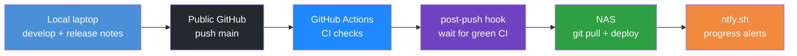

# Lessons learned (part 2)

## Table of contents

<!-- markdown-toc:start -->
- [Purpose](#purpose)
- [Working with agents](#working-with-agents)
- [Junior-programmer mistakes](#junior-programmer-mistakes)
- [Infrastructure deployment](#infrastructure-deployment)
- [Remote SSH troubleshooting](#remote-ssh-troubleshooting)
- [Local server interaction: learn from SSH commands](#local-server-interaction-learn-from-ssh-commands)
- [QNAP SSH: wrong Linux path and the wrong sshd config](#qnap-ssh-wrong-linux-path-and-the-wrong-sshd-config)
  - [The agent used the wrong remote Linux path](#the-agent-used-the-wrong-remote-linux-path)
  - [How the agent recovered (and why that misled us)](#how-the-agent-recovered-and-why-that-misled-us)
  - [How we found the setup was pointed at the wrong file](#how-we-found-the-setup-was-pointed-at-the-wrong-file)
  - [Relation to the Airflow “no logs” session](#relation-to-the-airflow-no-logs-session)
- [Agent troubleshooting efficiency](#agent-troubleshooting-efficiency)
- [Learning new tools](#learning-new-tools)
- [Airflow version mismatch (agent-generated logging)](#airflow-version-mismatch-agent-generated-logging)
- [Design the platform before application code](#design-the-platform-before-application-code)
- [CI/CD process](#cicd-process)
- [Issue inventory and retrospectives](#issue-inventory-and-retrospectives)
- [App deploy versus infra deploy](#app-deploy-versus-infra-deploy)
- [From chat fix to pipeline design](#from-chat-fix-to-pipeline-design)
<!-- markdown-toc:end -->

## Purpose

This part of the POC consists of getting our hands dirty with [Apache Airflow](https://airflow.apache.org/). I'll try to not only document what goes well but also what goes wrong because that can be very insightful.

## Working with agents

Working with agents requires a high level of discipline. It is very tempting to trust the agent to do your work for you — to skip the boring design steps and let the next prompt produce something that runs. In this PoC I did not invest enough time in designing the infrastructure up front, which led to several poor decisions (unpinned passwords, identity that breaks on reboot, fix-on-failure instead of reviewed compose). The same pattern showed up in application code when state lived on the local filesystem until a server deploy forced a rethink ([Design the platform before application code](#design-the-platform-before-application-code)).

You cannot expect an agent to automatically follow industry best practices or apply every architectural design principle. It optimises for “works now” in the current session unless you steer it. Best practices and platform decisions must be **enforced by documentation** — architecture notes, CI/CD design, infra checklists, Cursor skills and rules — and by human review before changes land. Part 1’s [Keep Gen AI under control](lessons-learned-part1.md#keep-gen-ai-under-control) is the same idea at artifact scope; part 2 is the same idea at **platform and infra** scope.

**Takeaway:** Treat the agent as a fast implementer, not the architect. Document decisions and constraints first; review diffs; require reboot/restart tests for infra. Discipline is on you, not on the model.

## Junior-programmer mistakes

I use Cursor with **Auto** model selection — not the most capable (or expensive) model on every turn. That is fine for speed and cost, but it showed up clearly in application code: the agent often behaves like a **junior programmer** — fast, plausible, and easy to trust until you check the database.

A concrete example came from getting an Airflow DAG to “work.” After several troubleshooting sessions the task ran green and the logs reported that data had been **successfully written to Postgres**. Only when I queried Postgres did I find **no rows**. The failure was not exotic: the code followed the **happy path** — it logged success as if the write had completed — without checking that the database call actually succeeded (return value, row count, commit, or an error from the driver).

That mistake is basic engineering hygiene. A human reviewer would ask “how do you know it wrote?” The agent optimised for a green task and reassuring log lines, not for **verifiable side effects**. The same pattern appears elsewhere: assume the connection string is right because the client object was created; log “done” at the end of a `try` block without confirming persistence; treat “no exception” as “data landed.”

**Takeaway:** Do not trust success logs from agent-generated code until you **verify the outcome** (query Postgres, inspect the file, check row counts). In prompts and review, require explicit validation — check return codes, assert affected rows, fail the task on mismatch — and treat “DAG succeeded” as unrelated to “data is there” until you have proof.

## Infrastructure deployment

At first, Airflow was not installed correctly. It was missing the metadata database and some other pieces, and logging was not working. It took several prompts to fix this.

The installation was not performed in the best way overall. A concrete example: after almost every infra change, Docker had to be restarted. this generated a **new random admin password** each time — so the UI login kept breaking until I explicitly asked the agent to pin the password. This issue indicates to me that the Agent doesn't, by itself, think about all aspects of infrastructure deployment.

Another example: after every **server reboot** or **Docker restart**, opening the Airflow UI shows a handful of errors (sometimes five, sometimes two) because **internal IP addresses and ports** no longer match what the UI or workers expect. I have prompted several times to stabilise hostnames, published ports, and how Airflow advertises itself to the browser (e.g. log links, worker callbacks). The compose file was updated — fixed admin password, named Docker network, `hostname`, `AIRFLOW__CORE__HOSTNAME_CALLABLE` — but the problem still comes back on reboot. So the “fix” did not hold end-to-end: either something outside that file still changes on restart (Container Station, bridge networking, dynamic worker ports), or the agent addressed symptoms in the UI without verifying a full stop → reboot → browse cycle.

**Takeaway:** For infra, “it works in the browser once” is not enough. Require an explicit test after `docker compose down` / host reboot and treat recurring UI errors as a signal that identity (hostname, IP, port) is still not pinned.

And to be honest, this was probably caused by the fact that I Let the design and architectural choices of my infra configuration be completely up to the agent.

For the next time , I would use a more managed approach: document architectural decisions
and human review before anything is applied. E.g. Specify service levels for an infra-sys system and security design.

## Remote SSH troubleshooting

When the agent troubleshoots on the NAS, it logs in via SSH and runs Docker commands. Those often failed because `docker` was not on `PATH` in non-interactive SSH sessions (the shell gets a minimal `PATH` and does not load `~/.profile`). The agent recovered by looking up where Docker was installed — but it did that **many times** in the same session instead of fixing the environment once.

That pattern suggests the agent does not treat “repeat the same workaround” as an efficiency problem unless you say so. I had to **explicitly** prompt it to fix `PATH` (or source [`infra/scripts/nas-remote-env.sh`](infra/scripts/nas-remote-env.sh), which adds Container Station’s `docker` and other QNAP paths) so later commands could just use `docker`.

**Takeaway:** After the first `command not found` for a tool you will need again, tell the agent to persist the fix for the rest of the session — export `PATH`, source the env script, or add a small helper — and do not accept repeated `which docker` / `find` lookups.

## Local server interaction: learn from SSH commands

Fixing [INC-001](doc/operation/incident/inc-001-nas-ssh-environment.md) (PATH, login shell) was necessary but not sufficient. Agents still improvise `ssh bas@basnas '…'` from **Windows PowerShell** every session — nested quotes, remote pipes, `grep -E` patterns with `|`, `docker --format` strings, env vars, and remote paths. Each layer (PowerShell → SSH → remote Bash) can strip or reinterpret quotes, so a command that looks right in chat fails on the NAS with misleading errors such as `bash: postgres: command not found` when the real issue is **quoting**, not a missing package.

A concrete example: filtering containers with `grep -E "kafka|postgres|airflow"` inside single-quoted outer SSH failed because `|` became shell pipes on the NAS. A simpler `docker ps --format '{{.Names}}'` worked immediately. The fix belongs in **basnas-ssh** (copy-paste patterns, prefer Docker `--filter`, document bad vs good quoting) — not in the agent’s memory for the next chat.

**This does not happen automatically.** Cursor does not watch your terminal, diff failed vs successful SSH invocations, and update skills on its own. You (or a deliberate retro step) must:

1. **Monitor what actually ran** — terminal output, retry loops, and agent transcripts (`ssh bas@basnas`, `docker exec`, deploy scripts).
2. **Compare failed vs working commands** — often the difference is outer double quotes vs single quotes, avoiding remote pipes, or using `$LOCAL_SERVER_SSH` / documented paths instead of guessed NAS paths.
3. **Promote the working pattern** — ERR entry during the session; at release retro, propose updates to **basnas-ssh**, deploy skills, or `.cursor/troubleshooting-errors.md` prevention text.
4. **Prefer copy-paste blocks in skills** over “the agent will figure out quoting.”

**Release-cycle review** fits this well. At the end of each release (see [Issue inventory and retrospectives](#issue-inventory-and-retrospectives)), the [release-retrospective](https://github.com/basvdberg/cursor-config/blob/main/skills/release-retrospective/SKILL.md) workflow already scans chat transcripts when ERR/INC are incomplete. Extend that scan for **local-server interaction**:

- Grep transcripts for `ssh bas@basnas`, `docker exec`, `deploy-on-nas`, and non-zero exits or `command not found`.
- Note repeat failures (quoting, PATH, wrong remote path) and the command that finally worked.
- Add **Promotions** action items: e.g. “add quoting table to basnas-ssh”, “document container name `basnas_postgress`”, “use `docker ps --format` without remote grep by default”.

Same loop as ERR → INC → retro → lessons → skills; SSH command hygiene is just another promotion target, not a one-off chat fix.

**Takeaway:** Treat BasNAS interaction as a **curated skill surface** maintained from real commands. Watch what agents execute over SSH; codify what works at retro time. Quoting, paths, and env vars are enforceable in **basnas-ssh** — they are not inferred reliably session to session.

## QNAP SSH: wrong Linux path and the wrong sshd config

We had already built a one-time NAS fix: [`infra/scripts/setup-nas-ssh-env.sh`](infra/scripts/setup-nas-ssh-env.sh) writes `~/.local/bin/nas-path.sh`, a `docker` symlink, and `~/.ssh/environment`; [`enable-nas-ssh-user-env.sh`](infra/scripts/enable-nas-ssh-user-env.sh) sets `PermitUserEnvironment yes` so non-interactive `ssh bas@basnas 'docker …'` should pick up that PATH without a prefix on every command. Despite that, a Cursor agent session in June 2026 still could not run `docker` from a Windows terminal — and then **codified the wrong workaround** (`bash -lc` + source `nas-path.sh` on every invocation) instead of fixing the platform once.

### The agent used the wrong remote Linux path

From PowerShell the agent ran bare SSH:

```powershell
ssh bas@basnas 'docker ps'
```

That lands in QNAP’s **non-interactive** session: user `bas` has login shell `/bin/sh` in `/etc/passwd`, and sshd does **not** load `~/.profile` for a one-shot remote command. The effective `PATH` was only `/usr/bin:/bin:/usr/sbin:/sbin` — Container Station’s `docker` lives under `/share/CACHEDEV*_DATA/.qpkg/container-station/bin`, so the command failed with `sh: docker: command not found`.

That is the “wrong path” environment: not your laptop, but the **minimal remote shell** the agent chose by default. Interactive SSH (`ssh bas@basnas` then typing commands) would have loaded `nas-path.sh` from `~/.profile` and looked fine; automation and agents use `ssh host 'cmd'`, which is a different environment.

### How the agent recovered (and why that misled us)

The agent did not read [`infra/readme.md`](infra/readme.md#ssh-docker-command-not-found) or ERR-001 first. It backtracked:

1. Bare `ssh … 'docker …'` → failed.
2. `bash -lc '…'` with `source ~/.local/bin/nas-path.sh` → failed (tilde/`source` quoting from PowerShell).
3. `bash -lc` with the **full path** `. /share/homes/bas/.local/bin/nas-path.sh && docker …` → **worked**.

So the agent proved `docker` exists and PATH can be fixed — but only inside a login-style wrapper. It then ran all NAS diagnostics through that prefix and ended the session with an “SSH reminder” to always use `bash -lc` + `nas-path.sh`, which is exactly what the setup scripts were meant to eliminate.

### How we found the setup was pointed at the wrong file

After `setup-nas-ssh-env.sh` and `enable-nas-ssh-user-env.sh`, bare SSH still failed. The setup script printed `PermitUserEnvironment is enabled` — so it looked done. Comparing **what sshd actually runs** vs **what we patched** exposed the bug:

| Check | Wrong assumption | Actual on BasNAS |
|-------|------------------|------------------|
| Config file | `/etc/ssh/sshd_config` has `PermitUserEnvironment yes` | Running process: `/usr/sbin/sshd -f **/etc/config/ssh/sshd_config**` |
| Active config | Same as above | `/etc/config/ssh/sshd_config` had **no** `PermitUserEnvironment` |
| `~/.ssh/environment` | Should apply to `ssh 'cmd'` | File correct, but ignored because active sshd config never enabled it |
| Remote `PATH` on `ssh 'echo $PATH'` | Should include `~/.local/bin` | Still `/usr/bin:/bin:…` only |

Diagnostic commands that made the mismatch obvious:

```bash
ssh bas@basnas 'echo PATH=$PATH'
ssh bas@basnas 'grep PermitUserEnvironment /etc/ssh/sshd_config /etc/config/ssh/sshd_config'
ssh bas@basnas 'ps w | grep sshd'
```

Restarting SSH from the QNAP Control Panel reloads the **active** config; toggling SSH off/on does **not** add `PermitUserEnvironment` to `/etc/config/ssh/sshd_config` if it was only ever appended to `/etc/ssh/sshd_config`.

**Fix that worked (persistent):** after `setup-nas-ssh-env.sh`, set `bas` login shell in `/etc/passwd` to `/share/homes/bas/.local/bin/nas-login-sh` with `sudo sed` (QTS admin password). Bare `ssh bas@basnas 'docker -v'` then works across reboot. QNAP wipes manual `PermitUserEnvironment` in `/etc/config/ssh/sshd_config` on reboot; `ssh admin@basnas` is denied; Control Panel has no shell field. Codified in Cursor skill **basnas-ssh** (`cursor-config/skills/basnas-ssh`). See [INC-001](doc/operation/incident/inc-001-nas-ssh-environment.md).

### Relation to the Airflow “no logs” session

In the same agent session, “No logs available for this task” was traced to Airflow 3 (`ti.log` removed) — not missing `docker`. The PATH confusion still mattered: the agent could not inspect containers until it found the `bash -lc` workaround, which added noise and produced a permanent-looking reminder that future agents would copy. Separate **application** failures from **SSH environment** failures; fix SSH once at the platform layer.

**Takeaways:**

- Bare `ssh bas@basnas 'docker …'` is the contract agents should use after one-time setup; do not accept `bash -lc` + `nas-path.sh` as the documented default.
- On QNAP, verify the **active** sshd config (`ps` → `-f …`) before trusting “PermitUserEnvironment already enabled.”
- When a setup script reports success but behavior is unchanged, compare file on disk vs process command line — same pattern as [app deploy vs infra deploy](#app-deploy-versus-infra-deploy) (Git had the fix; the running stack did not).
- Point agents at [`troubleshooting-error-log`](.cursor/troubleshooting-errors.md) ERR-001 and [`infra/readme.md`](infra/readme.md) before they rediscover PATH in chat.

## Agent troubleshooting efficiency

While fixing infra on the NAS, the agent’s **backtracking** (try another command, another path, another workaround until something works) often unblocked the task — but it also **repeated the same faults** in one session: rediscovering where `docker` lives, re-running `which` / `find`, or retrying an approach that had already failed. Part 1 noted that Cursor is good at backtracking until an issue is fixed; part 2 showed that “fixed once” does not mean “remembered for the rest of the session.”

Improving troubleshooting **efficiency** does not seem to be a default goal while the agent is still driving toward a green exit code. Unless you say so, each failed command can be treated like a fresh problem rather than a signal to persist environment fixes or avoid known dead ends.

To make repeats visible and reviewable, I added a Cursor skill **`troubleshooting-error-log`**. It appends structured entries to `.cursor/troubleshooting-errors.md` in the workspace: command, error, short description, solution, **Prevention**, and a **Count** when the same error signature recurs. The agent should **read the log before retrying** and apply documented solutions instead of rediscovering them. When I ask for a review, the skill produces a summary (totals, repeated mistakes, efficiency recommendations) so patterns can become **permanent** fixes — skills, rules, [`infra/scripts/nas-remote-env.sh`](infra/scripts/nas-remote-env.sh), compose pins, and similar.

The NAS `PATH` / `docker` case above is a simple example: log it once with prevention “source `nas-remote-env.sh` at the start of SSH troubleshooting,” and later sessions should not pay for the same lookup loop.

**Takeaway:** Treat agent troubleshooting as a learning loop — log failures, deduplicate repeats, review periodically, and codify prevention in the repo so backtracking moves forward instead of circling the same mistakes.

## Learning new tools

I was new to Airflow and thought it was a visual tool to orchestrate data transformations. It turned out to be a scheduler of tasks where the tasks are defined in Python files stored in a linked folder (the DAGs directory). For my poller and extractor, that fits perfectly because I had already built them in Python.

Beyond generating starter code, the agent often acted as a **mentor**: it explained how Airflow actually behaves (DAG parsing, scheduler vs webserver, log URLs), what a stack trace or UI error likely meant, and what to try next — in the context of *this* PoC on the NAS. Instead of working through long official docs or hunting user forums, I could ask follow-up questions in the same session. That worked well for learning new tools quickly, especially when errors were environment-specific (Docker, SSH, QNAP paths).

**Takeaways:**

- Treat Airflow as a Python-defined task scheduler, not a drag-and-drop ETL designer.
- Use the agent as an on-demand tutor for tool behavior and errors; pair that with docs when you need authoritative reference or edge-case depth.
- For infra, decide early what must survive restarts (passwords, volumes, ports, hostnames) and document it; do not assume the first agent-generated compose file is production-ready.
- PoC: agent-driven install and fix-on-failure is acceptable. Production: design, document, and review infra before deploy.

## Airflow version mismatch (agent-generated logging)

The Cursor agent generated DAG code for an **older Airflow API** while the NAS runs **Airflow 3.2.0** (`apache/airflow:3.2.0` in [`infra/airflow/docker-compose.standalone.yaml`](infra/airflow/docker-compose.standalone.yaml)). Using the latest Airflow patterns in generated code, or **aligning with the version installed on the local server**, is not done by default — the agent optimises for patterns it has seen in training (often Airflow 2.x examples) unless you pin the version in the prompt, rules, or compose.

The symptom looked like infra slowness or missing logs: after triggering the poller DAG, the schedule grid showed **no status** for a long time and the task log view showed only **“No logs available for this task.”** The UI felt unresponsive when starting a task. In reality the task **did** start, failed on the first line, and retried every five minutes — because the wrong logger API was invoked.

The broken pattern was `get_current_context()["ti"].log` in [`code/airflow/dags/openmeteo_data_object_poller.py`](code/airflow/dags/openmeteo_data_object_poller.py). In Airflow 3, task execution exposes `RuntimeTaskInstance` in context; it has **no `.log` attribute** (unlike Airflow 2’s `TaskInstance`). The callable raised `AttributeError: 'RuntimeTaskInstance' object has no attribute 'log'` before any user-facing log line. Log files on disk contained only JSON error metadata, which the UI did not surface as normal task output.

**Fix:** remove `ti.log` and other DAG-side logging helpers; call the poller CLI from a plain `PythonOperator` and let Airflow 3's default task logging capture CLI output (`configure_logging()` skips replacing handlers when `AIRFLOW_CTX_DAG_ID` is set).

**Takeaways:**

- State the **installed Airflow major version** (from compose image tag or `docker exec airflow-standalone airflow version`) in agent prompts and Cursor rules when editing DAGs.
- Do not assume `ti.log`, `ti.queue`, or other TaskInstance-only APIs work in Airflow 3 without checking the [task logging docs](https://airflow.apache.org/docs/apache-airflow/stable/administration-and-deployment/logging-monitoring/logging-tasks.html).
- When the UI shows “No logs available” for minutes, read the attempt log on disk (`docker exec airflow-standalone cat …/attempt=1.log`) before chasing scheduler delay or pip install time.
- A stuck DAG run in `running` after repeated crashes can block new triggers when `max_active_runs=1`; clear or fail it before re-testing.

## Design the platform before application code

Early in this PoC I started generating code for the [extractor and poller](code/extractor_and_poller/readme.md). That felt productive — GenAI can produce a working client quickly (see [part 1](lessons-learned-part1.md#data-extraction-via-api)) — but the first implementation stored **runtime state on the local filesystem** (a folder beside the process). On a laptop that is fine; on the NAS and in scheduled Airflow tasks it is not: containers restart, working directories differ, and multiple runs do not share durable state reliably.

I upgraded poller execution history and markers to **PostgreSQL** ([`code/postgres/schema.sql`](code/postgres/schema.sql), [`poller/state.py`](code/extractor_and_poller/poller/state.py)). That fixed persistence for the server, but it also meant rework: schema, connection config, and deploy steps that could have been decided up front.

The broader lesson is not only “use a database on the server,” but **design the whole platform before writing application code** — even for a PoC:

- **Dev and prod environments** — where processes run, how they reach Postgres, Airflow, and data volumes on the NAS.
- **CI/CD** — versioning, release notes, checks on push, and pull-based deploy to the server (see [CI/CD process](#cicd-process) and [meta data design](doc/design/meta-data-design.md) for Git-held *what* vs runtime *how*).
- **Operational concerns** — secrets, connection strings, migrations, and what must survive restarts.

Had I sketched that first, the extractor and poller could have targeted Postgres (or another shared store) from day one instead of learning it from a broken server deploy.

**Takeaway:** Fast AI-generated application code is tempting; for a PoC that will run on a real server, still **design environments, persistence, and deploy/versioning first**, then generate code against that contract.

## CI/CD process

I designed a CI/CD workflow that keeps release history and prompts in Git, without giving GitHub access to my internal server. Development happens on my local laptop; the public GitHub repo is the source of truth. A pre-commit hook (via [cursor-config](https://github.com/basvdberg/cursor-config)) uses skills and scripts to bump `release/VERSION`, create release notes from the template, sync `release/details/<version>/`, and list all prompts used in that release. After I push to `main`, GitHub Actions runs checks only — deployment is pull-based on the NAS.

A post-push Git hook starts a background watcher that waits until the commit is visible on `origin/main` and CI is green, then SSH-triggers `deploy-on-nas.sh` on the server. Every release is pulled and deployed this way. Progress notifications go through [ntfy.sh](https://ntfy.sh/) (topic `data-solution-2026-deploy`) so I can follow the pipeline from my phone without watching the terminal.

Full design: [CI/CD workflow (main only + server pull deploy)](doc/design/ci-cd.md).



**Takeaway:** Pull-based deploy from a public repo avoids inbound GitHub access to a private NAS; pair it with versioned release notes, automated prompt capture, and lightweight notifications so every release is traceable and hands-off after push.

Release notes are not hook scaffolding — they are the operator-facing record published to GitHub Releases. Leaving scope, changes, or validation blank (as in [v2026.06.05.6](release/notes/v2026.06.05.6.md) initially) hides failures such as [INC-004](doc/operation/incident/inc-004-airflow-pythonpath-drift.md) from anyone reading the release history.

**Takeaway (release discipline):** Fill release notes before push; run the validation checklist or mark each item N/A with a reason; link incidents and the [retrospective](release/retrospective/v2026.06.05.6.md) under **Related artifacts**.

## Issue inventory and retrospectives

Failures used to disappear into Cursor chat. A fix in one session did not appear in git, release notes, or the next agent context — which is why [INC-004](doc/operation/incident/inc-004-airflow-pythonpath-drift.md) was missing from the first draft of the [v2026.06.05.6 retrospective](release/retrospective/v2026.06.05.6.md) until I pointed at the chat. The same applies to **SSH command patterns** (quoting, paths): unless retro scans transcripts and promotes them to **basnas-ssh**, the next agent rediscovers the failure.

I introduced a layered inventory (see [operations hub](doc/operation/readme.md)):

| Layer | Where | Role |
|-------|-------|------|
| ERR | `.cursor/troubleshooting-errors.md` | Tactical log during debugging |
| INC | `doc/operation/incident/` | Blameless postmortem when impact is real |
| Retro | `release/retrospective/<version>.md` | Per-release roll-up and action items |
| Categories | [issue-category.md](doc/operation/issue-category.md) | Generalized themes across releases |
| Lessons | This document | Durable narrative for humans |

**Ceremony:** after each release, run a retrospective (agent drafts, I approve). Promote recurring patterns from retros into lessons-learned and into skills, rules, or checklists. Do not treat “no ERR entries” as “no incidents” without checking chat transcripts when something failed in another session.

**Takeaway:** Capture → classify → retro → lessons → guardrails. A fix that lives only in chat is not organizational learning.

## App deploy versus infra deploy

[INC-004](doc/operation/incident/inc-004-airflow-pythonpath-drift.md) showed a split I had not made explicit: **app deploy** (`deploy-on-nas.sh`, `git pull`) updates code under `~/apps/data-solution-2026`; **infra deploy** (`deploy-infra-on-nas.sh` or `RUN_INFRA_SYNC=1`) syncs compose files under `~/apache-airflow/` and recreates containers.

The repo already had the correct `PYTHONPATH` in [`infra/airflow/docker-compose.standalone.yaml`](infra/airflow/docker-compose.standalone.yaml). The running stack did not, because only the app had been pulled. The DAG imported `dag_run_guard` from `code/airflow/`, which is on the filesystem but was not on `PYTHONPATH` in the container.

**Takeaway:** When DAGs import modules outside `dags/`, or when `infra/` compose env vars change, run **infra sync** — not app-only pull. Add `airflow dags list-import-errors` to release validation (now in the [release template](release/release-notes-template.md)).

This is the same category family as [Infrastructure deployment](#infrastructure-deployment) (pin identity, verify after restart) and [Design the platform before application code](#design-the-platform-before-application-code) (platform contract before app code): the **platform** (compose, env, paths) and the **application** (Git tree) deploy on different paths.

## From chat fix to pipeline design

[INC-004](doc/operation/incident/inc-004-airflow-pythonpath-drift.md) is a good example of a failure that spans **application and infrastructure**. A path moved in the repo and `PYTHONPATH` was updated in [`infra/airflow/docker-compose.standalone.yaml`](infra/airflow/docker-compose.standalone.yaml), but the running Airflow stack on the NAS still had the old compose file. The DAG then failed to import `dag_run_guard` from `code/airflow/`.

In a Cursor chat session this is easy to unblock: SSH to the NAS, run `deploy-infra-on-nas.sh`, confirm `airflow dags list-import-errors` is empty. The symptom goes away quickly. That tactical fix is fine for a one-off, but it does not answer whether the **system** caused the problem.

The design gap was in CI/CD, not in the compose file itself. The pipeline always ran **app deploy** (`git pull` under `~/apps/data-solution-2026`) after green CI; it did **not** run **infra deploy** when only `infra/` runtime files changed. So a correct change in Git could still leave the live stack behind — exactly what happened when app code and infra paths moved together.

The more robust fix is to make the pipeline **infra-aware**: run an infra sync only when infrastructure meaningfully changes, not on every release. Pre-commit now updates [`release/deploy-config.json`](release/deploy-config.json) via `update-deploy-config.ps1` (diff since the latest `v*` tag against compose, `.env.example`, and deploy scripts under `infra/`). [`deploy-on-nas.sh`](release/scripts/deploy-on-nas.sh) reads `sync_infra` and calls [`deploy-infra-on-nas.sh`](infra/scripts/deploy-infra-on-nas.sh) when the flag is true; `RUN_INFRA_SYNC=1` remains a manual override. Documented in [CI/CD workflow](doc/design/ci-cd.md#server-side-deploy-script).

That closes the loop for this class of drift. It does not replace recording what went wrong during the PoC.

Failures in a proof of concept are **data**: they show where design, automation, or agent workflow is weak. If they stay only in chat, you fix the same gap again in the next session. Record them per sprint or per release — ERR during debugging, INC when impact is real, [retrospective](release/retrospective/v2026.06.05.6.md) roll-up after each version — then ask in retro whether the fix should be:

- a **generic design change** (e.g. conditional infra sync in CI/CD, validation checklist items), or
- a **change in how we work with Cursor** (log ERR before closing the chat, scan transcripts in retro, promote skills/rules).

See [Issue inventory and retrospectives](#issue-inventory-and-retrospectives) for the ceremony; INC-004 promoted both pipeline design and process guardrails.

**Takeaway:** A green chat session after redeploying infra is not the end state. Ask whether CI/CD should have prevented the drift; automate that path when it should. Capture PoC issues per release so retrospectives can turn one-off fixes into durable design or workflow changes.

## Project structure

<!-- markdown-project-structure:start -->
- [Data Solution 2026](readme.md)
  - Code
    - Airflow
      - Dags
      - Include
      - Plugins
    - Extractor_And_Poller
      - Common
      - Extract
      - Openmeteo
        - Extractor
        - Poller
      - Poller
      - Tests
    - Postgres
      - Migrations
  - Connection
  - Data
    - Staging
      - Openmeteo
        - Daily_Temperature
  - Data Object
    - Source
      - Openmeteo
    - Staging
      - Openmeteo
  - Data Object Mapping
    - Staging
      - Openmeteo
  - Doc
    - Data Object Mapping
    - Design
      - Cicd
        - [CI/CD workflow (main only + server pull deploy)](doc/design/cicd/ci-cd.md)
      - Monitoring
        - [Monitoring architecture](doc/design/monitoring/monitoring-architecture.md)
      - [Airflow asset naming](doc/design/airflow-asset-naming.md)
      - [Event-based orchestration plan](doc/design/event-based-orchestration-plan.md)
      - [Meta data design](doc/design/meta-data-design.md)
    - Image
    - Implementation
      - [Implementation plan (Open-Meteo → event orchestration)](doc/implementation/implementation-plan.md)
    - Linked In
      - [Linkedin Post Part3V2](doc/linked-in/linkedin-post-part3v2.md)
    - Operation
      - [Event orchestration monitoring](doc/operation/event-orchestration-monitoring.md)
    - Retrospective
      - Incident
        - [INC-001 — NAS non-interactive SSH environment](doc/retrospective/incident/inc-001-nas-ssh-environment.md)
        - [INC-002 — Airflow standalone infra instability](doc/retrospective/incident/inc-002-airflow-infra-stability.md)
        - [INC-003 — Agent rediscovery and false-done verification](doc/retrospective/incident/inc-003-agent-process-gaps.md)
        - [INC-004 — Airflow PYTHONPATH drift (dag_run_guard import)](doc/retrospective/incident/inc-004-airflow-pythonpath-drift.md)
        - [INC-<NNN> — <short title>](doc/retrospective/incident/incident-template.md)
      - [Issue categories](doc/retrospective/issue-category.md)
    - [Implementation plan](doc/implementation-plan.md)
  - Infra
    - Airflow
      - Dags
    - Kafka
    - Postgres
  - Release
    - 2026
      - 06
        - 02
          - V2026.06.02.1
            - [Notes](release/2026/06/02/v2026.06.02.1/notes.md)
          - V2026.06.02.2
            - [Release v2026.06.02.2](release/2026/06/02/v2026.06.02.2/notes.md)
        - 03
          - V2026.06.03.1
            - [Release v2026.06.03.1](release/2026/06/03/v2026.06.03.1/notes.md)
          - V2026.06.03.2
            - [Release v2026.06.03.2](release/2026/06/03/v2026.06.03.2/notes.md)
          - V2026.06.03.3
            - [Release v2026.06.03.3](release/2026/06/03/v2026.06.03.3/notes.md)
          - V2026.06.03.4
            - [Release v2026.06.03.4](release/2026/06/03/v2026.06.03.4/notes.md)
            - [Retrospective](release/2026/06/03/v2026.06.03.4/retrospective.md)
        - 04
          - V2026.06.04.1
            - [Notes](release/2026/06/04/v2026.06.04.1/notes.md)
        - 05
          - V2026.06.05.6
            - [Notes](release/2026/06/05/v2026.06.05.6/notes.md)
            - [Retrospective](release/2026/06/05/v2026.06.05.6/retrospective.md)
        - 12
          - V2026.06.12.1
            - [Release v2026.06.12.1](release/2026/06/12/v2026.06.12.1/notes.md)
    - [Release <version>](release/release-notes-template.md)
    - [Retrospective — <version>](release/retrospective-template.md)
  - Schema
  - [Getting started](getting-started.md)
  - [Lessons learned](lessons-learned-part1.md)
  - [Lessons learned (part 2)](lessons-learned-part2.md)
  - [Lessons learned (part 3)](lessons-learned-part3.md)
- Related repositories
  - [Data Engineering 2026](https://github.com/basvdberg/data-engineering-2026) — Course and learning materials
  - [Data Engineering Design Patterns](https://github.com/basvdberg/data-engineering-design-patterns) — Design pattern catalogue
<!-- markdown-project-structure:end -->
