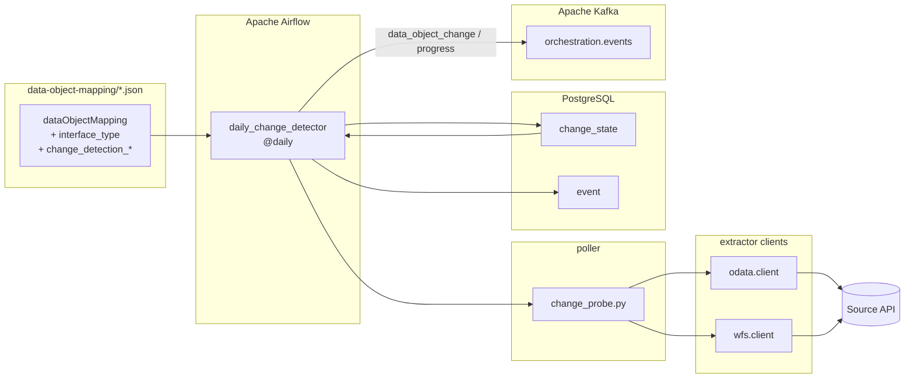

# Data object poller — Airflow + Kafka implementation

## Table of contents

<!-- markdown-toc:start -->
- [Purpose](#purpose)
- [How it works](#how-it-works)
- [Change detection by interface type](#change-detection-by-interface-type)
  - [OData v4](#odata-v4)
  - [WFS 2.0 (via the WFS extractor client)](#wfs-20-via-the-wfs-extractor-client)
  - [KNMI Open Data (KDP file catalog)](#knmi-open-data-kdp-file-catalog)
  - [Open-Meteo (Forecast API)](#open-meteo-forecast-api)
- [Pattern-to-implementation mapping](#pattern-to-implementation-mapping)
- [Architecture](#architecture)
- [Components](#components)
  - [Poll registry (JSON config)](#poll-registry-json-config)
  - [Change probe library (poller)](#change-probe-library-poller)
  - [Last known state (PostgreSQL)](#last-known-state-postgresql)
  - [Daily change detector DAG (Airflow)](#daily-change-detector-dag-airflow)
  - [Event bus messages (Kafka)](#event-bus-messages-kafka)
  - [Audit (PostgreSQL event)](#audit-postgresql-event)
- [Rollout plan](#rollout-plan)
  - [Step 1 — Local stack and runtime state](#step-1-local-stack-and-runtime-state)
  - [Step 2 — Configuration and library](#step-2-configuration-and-library)
  - [Step 3 — Daily change detector DAG](#step-3-daily-change-detector-dag)
- [Adding a new polled object](#adding-a-new-polled-object)
- [Local probe (without Airflow)](#local-probe-without-airflow)
- [Compliance with the design pattern rules](#compliance-with-the-design-pattern-rules)
- [Out of scope here](#out-of-scope-here)
<!-- markdown-toc:end -->

## Purpose

Implementation plan for the [data object poller](https://github.com/basvdberg/data-engineering-design-patterns/blob/main/design-patterns/data-object-poller.md) design pattern using Apache Airflow as the scheduler, Apache Kafka as the event bus, and PostgreSQL for baseline state. It generalises [plan 3](../plan3.md) so **any** enabled `dataObjectMapping` with `trigger:data_object_change` can be polled — Open-Meteo, OData (CBS), WFS, KNMI KDP, or future interface types — without source-specific DAG code.

The poller **only** detects marker changes and publishes to the event bus (`data_object_change` or `data_object_progress`). It reuses probe helpers from [data extractor](https://github.com/basvdberg/data-engineering-design-patterns/blob/main/design-patterns/data-extractor.md) clients but **never** runs extractors. Extraction is triggered separately by orchestration on **change** events ([event-based orchestration](https://github.com/basvdberg/data-engineering-design-patterns/blob/main/design-patterns/event-based-orchestration.md)).

## How it works

```text
Airflow @daily ─► daily_change_detector
                        │
                        ▼
   load PollRegistry: enabled mappings with trigger:data_object_change
                        │
                        ▼
   for each mapping:
      interface_type ─► poller.probe_current_value()
                        │
                        ▼
      compare to LastKnownState (PostgreSQL change_state)
                        │
            ┌───────────┴────────────┐
         unchanged                 changed
            │                        │
            ▼                        ▼
   Kafka: data_object_progress   Kafka: data_object_change
            │                        │
            │                        └── update LastKnownState
            └───────────┬────────────┘
                        ▼
                  append PollRun to event table
                        │
                        ▼
   (separate consumer) event controller on data_object_change only
                        ▼
                  enqueue extract command ─► extractor DAG / worker
```

Every successful poll emits **one** bus event. **Progress** informs monitoring; **change** updates the baseline and lets orchestration enqueue the matching extractor — the poller DAG does not call extractors.

## Change detection by interface type

Detection is **declared in JSON** (`classifications` + `extensions`) and executed by `poller/change_probe.py`, which dispatches on `interface_type` and calls the existing extractor clients. There is no second copy of OData or WFS HTTP logic in the poller.

### OData v4

| Extension | Role |
|-----------|------|
| `change_detection_endpoint` | Relative path on the dataset base URL (e.g. `Properties`) |
| `change_detection_field` | JSON field to treat as the marker (e.g. `Modified`) |

**API usage:** one `GET` to `{base_url}/{endpoint}`. The client (`extractor.odata.client.fetch_singleton`) returns a single JSON entity. The poller compares the string value of `change_detection_field` to `change_state.last_known_modified`. CBS and similar feeds expose a dataset-wide last-modified timestamp this way without reading observation rows.

### WFS 2.0 (via the WFS extractor client)

| Extension | Role |
|-----------|------|
| `wfs_type_name` | Feature type for `GetFeature` (same as extraction) |
| `change_detection_rule` | `wfs_max_period_end` — documented rule name |
| `change_detection_field` | `period_end` — semantic name of the marker (documentation) |
| `change_detection_probe_count` | Optional; features per probe (default `1`) |

**API usage:** a lightweight `GetFeature`, not a full paginated extract.

1. **`GetFeature`** with `count={change_detection_probe_count}` (often `1`) and GML output — implemented by `extractor.wfs.client.get_feature_gml`, shared with the WFS extractor.
2. **Parse marker only** — `extractor.wfs.gml_parser.extract_max_period_end` reads each `wfs:member`’s `om:phenomenonTime/gml:TimePeriod/gml:endPosition` and returns the **maximum** ISO timestamp. No measurement time-value pairs are flattened (unlike the full extract path).
3. **Compare** that string to the stored baseline.

For KNMI `omso:PointTimeSeriesObservation`, `period_end` reflects how far the station’s phenomenon time range extends on the server. When new daily observations are published, this end position advances; the poller treats a different max `period_end` as a source change.

**Note:** Some WFS servers (including KNMI on haleconnect.com) return the full embedded measurement series even when `count=1`. The poller still avoids flattening or landing that payload — it only parses `period_end` from the XML. Prefer `change_detection_probe_count=1` unless you need a max across multiple stations in one request.

```text
WFS probe (no bulk transfer)
────────────────────────────
GET ...?SERVICE=WFS&REQUEST=GetFeature&TYPENAMES=omso:PointTimeSeriesObservation&count=1
        │
        ▼
GML: max(gml:endPosition) over returned members  →  "2026-05-20T00:00:00Z"
        │
        ▼
compare to change_state.last_known_modified
```

**Legacy KNMI note:** the haleconnect WFS used in early PoC runs is frozen (~2023-09-01). KNMI daily data in this repo uses **KDP Open Data** below.

### KNMI Open Data (KDP file catalog)

| Extension | Role |
|-----------|------|
| `kdp_dataset_name` | Catalog dataset (e.g. `daily-in-situ-meteorological-observations`) |
| `kdp_dataset_version` | Version id (e.g. `1.0`) |
| `kdp_list_order_by` | `created` or `lastModified` |
| `kdp_list_sorting` | `desc` |
| `change_detection_rule` | `knmi_latest_file` |
| `change_detection_field` | `filename`, `created`, or `lastModified` from the newest file entry |

Connection: `base_url` = `https://api.dataplatform.knmi.nl/open-data/v1`, `api_key_env` = `KNMI_API_KEY`.

**API usage:** one authenticated list call — no NetCDF download in the poller.

```text
GET .../datasets/daily-in-situ-meteorological-observations/versions/1.0/files
    ?maxKeys=1&orderBy=created&sorting=desc
        │
        ▼
files[0].filename  →  "daily-observations-20260519.nc"
        │
        ▼
compare to change_state.last_known_modified
```

When KNMI publishes the next nightly `daily-observations-*.nc`, the filename (or `created`) changes and the poller emits `data_object_change`. Prefer a [registered API key](https://developer.dataplatform.knmi.nl/open-data-api); see [extractor/knmi/README.md](../../extractor/knmi/README.md).

### Open-Meteo (Forecast API)

| Extension | Role |
|-----------|------|
| `openmeteo_daily_variable` | e.g. `temperature_2m_mean` |
| `openmeteo_probe_latitude` / `openmeteo_probe_longitude` | Reference point for probe |
| `openmeteo_past_days` | Window for latest completed UTC day |
| `change_detection_rule` | `openmeteo_latest_day` |

**API usage:** one `GET` to the Forecast API with `past_days` for the probe; per-station `GET` with `start_date`/`end_date` only in the **extractor**, not the poller.

## Pattern-to-implementation mapping

| Design pattern entity | Implementation |
|-----------------------|----------------|
| `PollRegistry` | `data-object-mapping` JSON; `enabled = true` and `trigger:data_object_change` |
| `Schedule` | Airflow DAG `schedule="@daily"` |
| `ChangeDetectionRule` | Per `interface_type` extensions (OData, Open-Meteo, `knmi_latest_file`, `wfs_max_period_end`, …) |
| `LastKnownState` | PostgreSQL `change_state` (`mapping_id`, `last_known_modified`, `checked_at`) |
| `PollRun` | Airflow task run + row in PostgreSQL `event` |
| Event bus signal | Kafka `orchestration.events`: `data_object_change` or `data_object_progress` |
| Operational log & audit | Airflow logs + append-only `event` table |

## Architecture



## Components

### Poll registry (JSON config)

Each `dataObjectMapping` is one polled object when it has `trigger:data_object_change` and a supported `interface_type`.

**OData example:**

```json
{
  "id": "cbs-84583NED",
  "enabled": true,
  "classifications": [
    { "group": "interface_type", "classification": "odata_v4" },
    { "group": "trigger", "classification": "data_object_change" }
  ],
  "extensions": [
    { "key": "change_detection_endpoint", "value": "Properties" },
    { "key": "change_detection_field", "value": "Modified" }
  ],
  "sourceDataObjects": [{
    "name": "Observations",
    "dataConnection": {
      "extensions": [
        { "key": "base_url", "value": "https://datasets.cbs.nl/odata/v1/CBS/84583NED" }
      ]
    }
  }]
}
```

**KNMI Open Data example (active):**

```json
{
  "id": "knmi-daggegevens-temperature",
  "enabled": true,
  "classifications": [
    { "group": "interface_type", "classification": "knmi_open_data" },
    { "group": "trigger", "classification": "data_object_change" }
  ],
  "extensions": [
    { "key": "change_detection_rule", "value": "knmi_latest_file" },
    { "key": "change_detection_field", "value": "filename" },
    { "key": "kdp_dataset_name", "value": "daily-in-situ-meteorological-observations" },
    { "key": "kdp_dataset_version", "value": "1.0" },
    { "key": "kdp_list_order_by", "value": "created" },
    { "key": "kdp_list_sorting", "value": "desc" }
  ],
  "sourceDataObjects": [{
    "dataConnection": {
      "extensions": [
        { "key": "base_url", "value": "https://api.dataplatform.knmi.nl/open-data/v1" },
        { "key": "api_key_env", "value": "KNMI_API_KEY" }
      ]
    }
  }]
}
```

### Change probe library (`poller`)

| Module | Responsibility |
|--------|----------------|
| `change_probe.py` | `probe_current_value()`, `poll_mapping()`, `poll_registry()` — dispatch by `interface_type` |
| `state.py` | `FileStateStore` for local runs (Airflow uses PostgreSQL instead) |

Airflow DAG code is a thin wrapper:

```python
from extractor.common import config
from poller import change_probe, state as poller_state  # state → Postgres adapter in prod
from lib import events  # Kafka + event table

def detect_changes():
    cfg = config.load("data-object-mapping/staging/openmeteo/openmeteo-daily-temperature.json")
    store = poller_state.PostgresStateStore(conn_id="postgres_orchestration")  # planned
    for result in change_probe.poll_registry(cfg, store):
        from poller.events import from_poll_result, to_bus_payload
        event = from_poll_result(result)
        events.emit(to_bus_payload(event))  # data_object_change or data_object_progress
```

New protocols: add one `_probe_*` function and register it in `_PROBE_BY_INTERFACE` — no DAG fork per source.

### Last known state (PostgreSQL)

```sql
CREATE TABLE IF NOT EXISTS change_state (
    mapping_id          TEXT PRIMARY KEY,
    last_known_modified TEXT,
    checked_at          TIMESTAMPTZ NOT NULL DEFAULT NOW()
);
```

Updated **only** when a poll detects a change and the signal path succeeds (pattern rule: *baseline on success only*).

### Daily change detector DAG (Airflow)

- `schedule="@daily"`
- Single `PythonOperator` calling `detect_changes()` as above
- No `odata.fetch_singleton` or WFS calls inside the DAG file — only `poller`

### Event bus messages (Kafka)

| Property | Value |
|----------|-------|
| Topic | `orchestration.events` |
| Key | `mapping_id` |
| `event_type` | `data_object_change` when marker changed; `data_object_progress` when unchanged |
| Fields | `mapping_id`, `data_object_name`, `current_marker`, `previous_marker`, `polled_at_utc` |
| Retention | 7 days (replay window) |

The event controller subscribes to **`data_object_change`** only and enqueues extract commands. **`data_object_progress`** is for monitoring and audit.

### Audit (PostgreSQL `event`)

Every emitted signal — and every probe failure — is appended to the `event` table for replay and incident analysis, independent of Kafka retention.

## Rollout plan

Three steps. Focused subset of [plan 3 steps 1–4](https://github.com/basvdberg/data-solution-2026/blob/main/plan/plan3.md#rollout-plan).

### Step 1 — Local stack and runtime state

**Goal:** Postgres, Kafka, and Airflow running locally; `change_state` and `event` tables exist.

- `docker-compose.yml` with `postgres:16`, `apache/kafka:3.7`, `apache/airflow:2.9-python3.11`.
- Apply `metadata/01-schema.sql`.
- Create Kafka topic `orchestration.events`.
- Airflow connections: `postgres_orchestration`, `kafka_default`.

**Done when** `docker compose up` is healthy and both tables exist.

### Step 2 — Configuration and library

**Goal:** Validated JSON registry and shared probe library (already in `poller` + WFS/OData clients).

- Mappings under `data-object-mapping/` with `interface_type` and change-detection extensions.
- `lib/events.py` — Kafka producer + INSERT into `event` (planned alongside Airflow).
- Postgres adapter implementing `StateStore` for production.

**Done when** `python -m poller --probe-only` returns a marker for each configured mapping.

### Step 3 — Daily change detector DAG

**Goal:** Scheduled poller emits `data_object_change` or `data_object_progress` per mapping every run.

- `dags/daily_change_detector.py` calling `change_probe.poll_registry`.
- Manual trigger; second run produces zero events if sources are unchanged.
- `DELETE FROM change_state WHERE mapping_id = '...'` forces re-detection.

## Adding a new polled object

Configuration-only: add one `dataObjectMapping` with `enabled`, `trigger:data_object_change`, the right `interface_type`, and probe extensions. No new DAG or duplicate HTTP client.

| Interface | Required extensions |
|-----------|---------------------|
| `odata_v4` | `change_detection_endpoint`, `change_detection_field`; `base_url` on connection |
| `knmi_open_data` | `kdp_dataset_name`, `kdp_dataset_version`, `change_detection_rule=knmi_latest_file`; `KNMI_API_KEY` env |
| `wfs_v2` | `wfs_type_name`, `change_detection_rule=wfs_max_period_end` (legacy feeds only) |

## Local probe (without Airflow)

From `data-solution-2026/`:

```powershell
pip install -r extractor/requirements.txt

# Current WFS marker only (no baseline file update)
python -m poller --probe-only `
  --config data-object-mapping/staging/knmi/knmi-daggegevens.json `
  --mapping knmi-daggegevens-temperature

# Compare to .poller-state.json and update baseline on change
python -m poller --config data-object-mapping/staging/knmi/knmi-daggegevens.json
```

Exit code `1` means at least one mapping **changed** (useful for shell checks); `0` means all unchanged.

## Compliance with the design pattern rules

| Rule | How this implementation satisfies it |
|------|--------------------------------------|
| No bulk transfer | OData: one metadata entity; WFS: `GetFeature` with small `count`, marker parse only |
| Baseline on success only | `change_state` updated after successful probe + emit |
| Declared detection rules | Extensions + `interface_type` per mapping |
| Structured signals | Typed Kafka event; consumers do not parse logs |
| Configurable registry | Git-versioned `data-object-mapping` JSON |

## Out of scope here

- Full extraction (`python -m extractor.wfs` / `extractor.odata`) — see [data extractor](../../design-patterns/data-extractor.md).
- Routing events to commands (`event_controller` DAG) — see [event-based orchestration](../../design-patterns/event-based-orchestration.md).
- Multi-broker Kafka, HA Airflow, secrets management.

## Project structure

<!-- markdown-project-structure:start -->
- [Data Solution 2026](../../readme.md)
  - Data
    - Staging
      - Openmeteo
        - Daily_Temperature
  - Data Object Mapping
    - Staging
      - Knmi
      - Openmeteo
  - Docs
  - Extractor
    - Common
    - Knmi
    - Odata
    - Openmeteo
    - Poller
    - Wfs
  - Plan
    - Data Object Poller
      - [Data object poller — Airflow + Kafka implementation](airflow-kafka.md)
    - [Phase one: CBS OData extraction with event-based orchestration](../plan1.md)
    - [Phase two: minimal Dutch government OData ingestion with event-based orchestration](../plan2.md)
    - [Phase three: JSON-configured Dutch government OData ingestion](../plan3.md)
  - Poller
  - Schema
    - [Schema follow-ups](../../schema/data-objects-schema.md)
- Related repositories
  - [Data Engineering 2026](https://github.com/basvdberg/data-engineering-2026)
  - [Data Engineering Design Patterns](https://github.com/basvdberg/data-engineering-design-patterns)
<!-- markdown-project-structure:end -->
