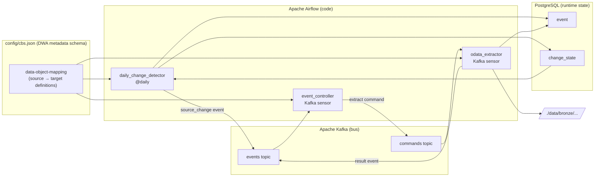

# Phase three: JSON-configured Dutch government OData ingestion

## Table of contents

<!-- markdown-toc:start -->
- [Goal](#goal)
- [Why a third plan](#why-a-third-plan)
- [Scope](#scope)
- [Dutch government OData sources](#dutch-government-odata-sources)
- [Architecture in one picture](#architecture-in-one-picture)
- [The DWA metadata schema as configuration format](#the-dwa-metadata-schema-as-configuration-format)
  - [Schema concepts used](#schema-concepts-used)
  - [Full CBS configuration example](#full-cbs-configuration-example)
  - [How extensions replace the property tree](#how-extensions-replace-the-property-tree)
- [Strict separation: code vs configuration](#strict-separation-code-vs-configuration)
- [PostgreSQL: runtime state only](#postgresql-runtime-state-only)
  - [change_state](#change_state)
  - [event](#event)
  - [Schema script](#schema-script)
- [Code: three generic Airflow DAGs](#code-three-generic-airflow-dags)
  - [DAG 1 — daily_change_detector](#dag-1-daily_change_detector)
  - [DAG 2 — event_controller](#dag-2-event_controller)
  - [DAG 3 — odata_extractor](#dag-3-odata_extractor)
- [Kafka topic design](#kafka-topic-design)
- [How "fetch daily, only when changed" works](#how-fetch-daily-only-when-changed-works)
- [Rollout plan](#rollout-plan)
  - [Step 1 — Local stack](#step-1-local-stack)
  - [Step 2 — Configuration file and runtime schema](#step-2-configuration-file-and-runtime-schema)
  - [Step 3 — Generic library](#step-3-generic-library)
  - [Step 4 — Daily change detector DAG](#step-4-daily-change-detector-dag)
  - [Step 5 — Event controller DAG](#step-5-event-controller-dag)
  - [Step 6 — OData extractor DAG and end-to-end demo](#step-6-odata-extractor-dag-and-end-to-end-demo)
  - [Step summary](#step-summary)
- [Adding a new dataset (configuration-only)](#adding-a-new-dataset-configuration-only)
<!-- markdown-toc:end -->

## Goal

Build the smallest possible working implementation of the [event-based orchestration](../data-engineering-design-patterns/design-patterns/event-based-orchestration.md) pattern that ingests free OData feeds from the Dutch government on a daily schedule, but only triggers an actual extraction when the source has changed since the previous run.

All source-to-target configuration is expressed in a JSON file that conforms to the open [Data Warehouse Automation Metadata Schema v2.0](https://github.com/data-solution-automation-engine/data-warehouse-automation-metadata-schema/blob/main/GenericInterface/interfaceDataWarehouseAutomationMetadataV2_0.json). PostgreSQL is used only for mutable runtime state (events and change-detection checkpoints), not for configuration.

## Why a third plan

`plan2.md` stores all configuration in a PostgreSQL Object-Property tree. That approach requires SQL seed scripts, a metadata client library with property-inheritance logic, and a running database before any configuration can be read. This plan replaces all of that with a single JSON file that can be read, diffed, and reviewed like any other source file.

| Concern | plan2.md | plan3.md |
| --- | --- | --- |
| Configuration format | 6 PostgreSQL tables (DESL subset) | 1 JSON file (DWA metadata schema) |
| Property inheritance | Custom `resolve_properties()` walking the object tree | Not needed — each mapping is self-contained |
| Configuration versioning | SQL seed scripts in `metadata/` | JSON in `config/`, tracked by git |
| PostgreSQL role | Configuration + runtime state | Runtime state only (2 tables) |
| Metadata library | `metadata.py` with 5 functions, SQL queries | `config.py` that calls `json.load()` |
| Rollout steps | 6 | 6 |

## Scope

**In scope**

- Daily change detection per dataset via the OData `Properties` endpoint.
- Event-driven extraction triggered only when the `Modified` field has changed.
- Parquet files written to a local landing folder.
- All source-to-target configuration in a single JSON file conforming to the DWA metadata schema.
- Controller rules and task templates expressed as JSON extensions inside the same file.

**Out of scope**

- Bronze → Silver → Gold transformations.
- Bitemporal history, schema drift detection, dead-letter handling.
- Authentication or private networking (Dutch OData feeds used here are anonymous).
- Production-grade Kafka/Airflow deployment — a single Docker Compose stack is enough.

## Dutch government OData sources

The Dutch government exposes several anonymous OData v4 feeds. Each one shares the same change-detection mechanism: a per-dataset `Properties` singleton with a `Modified` timestamp.

| Source | Base URL | Example dataset | What it contains |
| --- | --- | --- | --- |
| `cbs` (Statistics Netherlands) | `https://datasets.cbs.nl/odata/v1/CBS/` | `84583NED` | Macroeconomic indicators |
| `cbs` (Statistics Netherlands) | `https://datasets.cbs.nl/odata/v1/CBS/` | `85523NED` | Population per municipality |
| `cbs` (Statistics Netherlands) | `https://datasets.cbs.nl/odata/v1/CBS/` | `37296ned` | Birth, death, migration |

The implementation is generic: any anonymous OData v4 feed with a `Properties` endpoint plugs in by adding a `dataObjectMapping` to the JSON file.

## Architecture in one picture



Three short DAGs, two Kafka topics, one JSON config file, two small PostgreSQL tables. Nothing else.

## The DWA metadata schema as configuration format

### Schema concepts used

The [DWA metadata schema v2.0](https://github.com/data-solution-automation-engine/data-warehouse-automation-metadata-schema) defines a standard way to describe source-to-target data mappings. This plan uses five of its building blocks:

| DWA concept | Role in this plan |
| --- | --- |
| `dataObjectMapping` | One per dataset extraction (e.g. CBS `84583NED` OData → Parquet landing). Contains `enabled` flag, `extensions`, and child mappings. |
| `dataObject` | Represents either a source object (an OData table like `Observations`) or a target object (a Parquet landing path). |
| `dataConnection` | Attached to source objects. Holds the connection name (e.g. `cbs-odata-v1`), with `extensions` carrying `base_url`. |
| `extension` | Key/value pairs for operational config: `change_detection_endpoint`, `change_detection_field`, `odata_page_size`, `landing_path_template`. |
| `classification` | Tags like `interface_type:odata_v4` and `trigger:source_change` that the controller uses for rule matching. |

The schema's `extensions` mechanism is a natural replacement for the Object-Property tree: instead of inheriting properties down a tree, each mapping carries its own flat set of key/value pairs. This is simpler and easier to diff in code review.

### Full CBS configuration example

The file `config/cbs.json` validates against `interfaceDataWarehouseAutomationMetadataV2_0.json`:

```json
{
  "dataObjectMappings": [
    {
      "id": "cbs-84583NED",
      "name": "CBS 84583NED to bronze landing",
      "enabled": true,
      "classifications": [
        { "classification": "interface_type:odata_v4" },
        { "classification": "trigger:source_change" }
      ],
      "extensions": [
        { "key": "change_detection_endpoint", "value": "Properties" },
        { "key": "change_detection_field", "value": "Modified" },
        { "key": "odata_page_size", "value": "10000" },
        { "key": "landing_path_template", "value": "./data/bronze/cbs/{dataset}/{table}/{date}.parquet" }
      ],
      "sourceDataObjects": [
        {
          "name": "Observations",
          "dataConnection": {
            "name": "cbs-odata-v1",
            "extensions": [
              { "key": "base_url", "value": "https://datasets.cbs.nl/odata/v1/CBS/84583NED" }
            ]
          }
        },
        {
          "name": "RegioSCodes",
          "dataConnection": {
            "name": "cbs-odata-v1",
            "extensions": [
              { "key": "base_url", "value": "https://datasets.cbs.nl/odata/v1/CBS/84583NED" }
            ]
          }
        },
        {
          "name": "PeriodenCodes",
          "dataConnection": {
            "name": "cbs-odata-v1",
            "extensions": [
              { "key": "base_url", "value": "https://datasets.cbs.nl/odata/v1/CBS/84583NED" }
            ]
          }
        }
      ],
      "targetDataObject": {
        "name": "84583NED",
        "dataConnection": {
          "name": "bronze-landing",
          "extensions": [
            { "key": "path", "value": "./data/bronze/cbs/84583NED" }
          ]
        }
      }
    },
    {
      "id": "cbs-85523NED",
      "name": "CBS 85523NED to bronze landing",
      "enabled": true,
      "classifications": [
        { "classification": "interface_type:odata_v4" },
        { "classification": "trigger:source_change" }
      ],
      "extensions": [
        { "key": "change_detection_endpoint", "value": "Properties" },
        { "key": "change_detection_field", "value": "Modified" },
        { "key": "odata_page_size", "value": "10000" },
        { "key": "landing_path_template", "value": "./data/bronze/cbs/{dataset}/{table}/{date}.parquet" }
      ],
      "sourceDataObjects": [
        {
          "name": "Observations",
          "dataConnection": {
            "name": "cbs-odata-v1",
            "extensions": [
              { "key": "base_url", "value": "https://datasets.cbs.nl/odata/v1/CBS/85523NED" }
            ]
          }
        }
      ],
      "targetDataObject": {
        "name": "85523NED",
        "dataConnection": {
          "name": "bronze-landing",
          "extensions": [
            { "key": "path", "value": "./data/bronze/cbs/85523NED" }
          ]
        }
      }
    }
  ],
  "name": "CBS OData ingestion mappings",
  "classifications": [
    { "classification": "source:cbs" },
    { "classification": "protocol:odata_v4" }
  ],
  "extensions": [
    { "key": "default_change_detection_endpoint", "value": "Properties" },
    { "key": "default_change_detection_field", "value": "Modified" },
    { "key": "default_odata_page_size", "value": "10000" }
  ]
}
```

### How extensions replace the property tree

In plan2, adding `change_detection_field=Modified` to a source meant inserting a `property` row, then linking it to an object via `data_object_property`. Changing it for one dataset required understanding inheritance rules and overrides. In plan3, the same information is a key/value pair inside the mapping's `extensions` array:

```json
{ "key": "change_detection_field", "value": "Modified" }
```

| Plan2 concept | Plan3 equivalent |
| --- | --- |
| `data_object` tree (source > dataset > table) | `dataObjectMapping` → `sourceDataObjects` |
| `property` catalogue | Not needed — keys are free-form strings |
| `data_object_property` with inheritance | `extensions` array on each mapping (flat, explicit) |
| `data_object.ingestion_enabled` | `dataObjectMapping.enabled` |
| `task_template` row in SQL | `classification: "interface_type:odata_v4"` on the mapping |
| `controller_rule` row in SQL | `classification: "trigger:source_change"` on the mapping |

The trade-off is explicit: plan3 duplicates some values across mappings (e.g. `change_detection_field` appears on each) instead of inheriting them from a parent. For a small number of datasets this is clearer. For hundreds of datasets, the top-level `extensions` serve as documented defaults, and a simple Python function merges them with per-mapping overrides.

## Strict separation: code vs configuration

The same principle as plan2: **anything source-specific lives in the JSON file, anything generic lives in Python**.

| Decision | Where it lives | Format |
| --- | --- | --- |
| Which datasets to ingest | `config/cbs.json` → `data-object-mapping` | JSON (DWA schema) |
| Which tables per dataset | `config/cbs.json` → `sourceDataObjects` | JSON (DWA schema) |
| OData base URL | `config/cbs.json` → `dataConnection.extensions` | JSON key/value |
| Change detection field | `config/cbs.json` → mapping `extensions` | JSON key/value |
| Interface type | `config/cbs.json` → `classifications` | JSON tag |
| Trigger rule | `config/cbs.json` → `classifications` | JSON tag |
| Last known Modified | PostgreSQL `change_state` table | Mutable row |
| Event log | PostgreSQL `event` table | Append-only |
| OData pagination logic | Python `lib/odata.py` | Code |
| Parquet writing logic | Python `lib/parquet.py` | Code |
| When to check | Airflow `schedule="@daily"` | Code |

Adding a new Dutch government OData feed never modifies any `.py` file.

## PostgreSQL: runtime state only

PostgreSQL is reduced to two tables that hold mutable state which changes during execution. Configuration is gone from the database entirely.

### `change_state`

Stores the last observed `Modified` value per dataset so the change detector can compare.

| Column | Type | Purpose |
| --- | --- | --- |
| `mapping_id` | `text` PK | Matches `dataObjectMapping.id` (e.g. `cbs-84583NED`) |
| `last_known_modified` | `text` | Value of `Modified` from the last successful check |
| `checked_at` | `timestamp` | When the last check happened |

### `event`

Append-only log of every event produced. Same structure as plan2 (aligned with the DESL `event` entity) for replay and audit.

### Schema script

A single SQL file creates both tables:

```sql
CREATE TABLE IF NOT EXISTS change_state (
    mapping_id          TEXT PRIMARY KEY,
    last_known_modified TEXT,
    checked_at          TIMESTAMPTZ NOT NULL DEFAULT NOW()
);

CREATE TABLE IF NOT EXISTS event (
    event_id         BIGSERIAL PRIMARY KEY,
    event_timestamp  TIMESTAMPTZ NOT NULL DEFAULT NOW(),
    event_type       TEXT NOT NULL,
    event_status     TEXT NOT NULL,
    mapping_id       TEXT NOT NULL,
    object_name      TEXT NOT NULL,
    correlation_id   TEXT,
    idempotency_key  TEXT,
    payload          JSONB
);

CREATE INDEX IF NOT EXISTS idx_event_timestamp ON event (event_timestamp);
CREATE INDEX IF NOT EXISTS idx_event_filter ON event (event_type, event_status);
```

That is the entire database footprint — two tables, no seed data required.

## Code: three generic Airflow DAGs

Each DAG reads configuration from the JSON file and runtime state from PostgreSQL. None of them contains source-specific logic.

### DAG 1 — `daily_change_detector`

```text
schedule: @daily
purpose:  for each enabled mapping, call the OData Properties endpoint,
          compare Modified with change_state, emit source_change event
          on Kafka if (and only if) the value changed.
```

Body, in essence:

```python
from lib import config, odata, events, state

def detect_changes():
    cfg = config.load("config/cbs.json")
    for mapping in cfg.enabled_mappings():
        ext = mapping.extensions_dict()
        base_url = mapping.source_connection_ext("base_url")
        endpoint = ext["change_detection_endpoint"]
        field = ext["change_detection_field"]

        current = odata.fetch_singleton(
            f"{base_url}/{endpoint}"
        )[field]

        previous = state.get_last_known_modified(mapping.id)
        if current != previous:
            events.emit(
                event_type="source_change",
                event_status="end_successful",
                mapping_id=mapping.id,
                object_name=mapping.target_name(),
                payload={"previous": previous, "current": current},
            )
            state.set_last_known_modified(mapping.id, current)
```

### DAG 2 — `event_controller`

```text
schedule: triggered by AwaitMessageTriggerFunctionSensor on `events` topic
purpose:  match each event against classifications on the mappings and
          publish a command on the `commands` topic.
```

Body:

```python
from lib import config, commands

def route(event):
    cfg = config.load("config/cbs.json")
    mapping = cfg.get_mapping(event["mapping_id"])
    if mapping and mapping.has_classification("trigger:" + event["event_type"]):
        interface_type = mapping.get_classification_value("interface_type")
        commands.emit(
            interface_type=interface_type,
            mapping_id=mapping.id,
            correlation_id=event.get("correlation_id"),
        )
```

### DAG 3 — `odata_extractor`

```text
schedule: triggered by AwaitMessageTriggerFunctionSensor on `commands` topic
          filtered by interface_type = odata_v4
purpose:  paginate every source data object and write Parquet.
```

Body:

```python
from lib import config, odata, parquet, events

def extract(command):
    cfg = config.load("config/cbs.json")
    mapping = cfg.get_mapping(command["mapping_id"])
    ext = mapping.extensions_dict()
    page_size = int(ext.get("odata_page_size", "10000"))
    template = ext["landing_path_template"]

    for source_obj in mapping.source_data_objects():
        base_url = source_obj.connection_ext("base_url")
        df = odata.fetch_all(
            f"{base_url}/{source_obj.name}",
            page_size=page_size,
        )
        parquet.write(df, template, {
            "dataset": mapping.target_name(),
            "table":   source_obj.name,
            "date":    today_iso(),
        })
        events.emit(
            event_type="write",
            event_status="end_successful",
            mapping_id=mapping.id,
            object_name=source_obj.name,
        )
```

## Kafka topic design

| Topic | Key | Retention | Purpose |
| --- | --- | --- | --- |
| `orchestration.events` | `mapping_id` | 7 days | All events: change detected, extraction succeeded/failed |
| `orchestration.commands` | `interface_type` | 3 days | Commands from controller to executor |

Identical to plan2. A single Docker Compose Kafka broker in KRaft mode is sufficient.

## How "fetch daily, only when changed" works

```text
00:00 UTC      Airflow fires daily_change_detector
               │
               ▼
Load config/cbs.json → iterate enabled data-object-mapping

For mapping "cbs-84583NED":
   ext["change_detection_endpoint"] = "Properties"
   ext["change_detection_field"]    = "Modified"
   base_url from sourceDataObjects[0].dataConnection = ".../CBS/84583NED"

   GET https://datasets.cbs.nl/odata/v1/CBS/84583NED/Properties
   →  { "Modified": "2026-05-10T08:00:00Z" }

   SELECT last_known_modified FROM change_state
   WHERE mapping_id = 'cbs-84583NED';
   →  '2026-04-10T08:00:00Z'

   Different ⇒ produce event to Kafka:
     { event_type: "source_change", mapping_id: "cbs-84583NED",
       payload: { previous: "2026-04-10...", current: "2026-05-10..." } }

   UPDATE change_state SET last_known_modified = '2026-05-10T08:00:00Z'
   WHERE mapping_id = 'cbs-84583NED';

event_controller consumes the event, checks classification
"trigger:source_change" on the mapping, publishes a command:
     { interface_type: "odata_v4", mapping_id: "cbs-84583NED" }

odata_extractor consumes the command, iterates sourceDataObjects
(Observations, RegioSCodes, PeriodenCodes), downloads each via OData,
writes Parquet, emits a write/end_successful event per table.
```

When CBS has not updated, the `Properties` call returns the same `Modified` value, no event is produced, and nothing else happens.

```text
implementation/dutch-odata-json/
├── README.md
├── docker-compose.yml                  # postgres + kafka + airflow
│
├── config/                             # configuration (DWA metadata JSON)
│   ├── cbs.json                        # CBS mappings (validates against DWA schema)
│   └── interfaceDataWarehouseAutomationMetadataV2_0.json  # schema for validation
│
├── metadata/                           # runtime state DDL
│   └── 01-schema.sql                   # change_state + event (2 tables)
│
├── dags/                               # code (generic, no source names)
│   ├── daily_change_detector.py
│   ├── event_controller.py
│   └── odata_extractor.py
│
└── lib/                                # code (generic helpers)
    ├── config.py                       # load and query DWA metadata JSON
    ├── odata.py                        # paginate any OData v4 endpoint
    ├── parquet.py                      # write a DataFrame to templated path
    ├── state.py                        # read/write change_state in PostgreSQL
    ├── events.py                       # produce/consume on events topic
    └── commands.py                     # produce/consume on commands topic
```

Compared to plan2, the `metadata/` folder shrinks from six SQL files to one (runtime DDL only). The six-file SQL seed is replaced by `config/cbs.json`. The `lib/metadata.py` (with inheritance logic and five SQL-backed functions) is replaced by `lib/config.py` (which calls `json.load()` and exposes helper methods).

## Rollout plan

Six steps, each independently demoable. Identical cadence to plan2, but steps 2 and 3 become simpler.

### Step 1 — Local stack

**Goal:** PostgreSQL, Kafka, and Airflow running locally via Docker Compose.

**Actions**

1. Write `docker-compose.yml` with three services: `postgres:16`, `apache/kafka:3.7` (KRaft, single broker), `apache/airflow:2.9-python3.11`.
2. Mount `./config`, `./dags`, and `./lib` into the Airflow container.
3. Add Airflow connection `postgres_orchestration` and `kafka_default`.
4. Install `apache-airflow-providers-apache-kafka`, `requests`, `pandas`, `pyarrow`, `psycopg[binary]`, `jsonschema`.

**Done when** `docker compose up` produces a healthy Airflow UI, an empty Postgres database, and Kafka topics can be created.

### Step 2 — Configuration file and runtime schema

**Goal:** `config/cbs.json` is written and validates against the DWA schema. The two runtime tables exist in PostgreSQL.

**Actions**

1. Write `config/cbs.json` with `data-object-mapping` for `84583NED` and `85523NED` (as shown above).
2. Validate: `python -c "import jsonschema, json; jsonschema.validate(json.load(open('config/cbs.json')), json.load(open('config/interfaceDataWarehouseAutomationMetadataV2_0.json')))"`.
3. Run `metadata/01-schema.sql` to create `change_state` and `event`.
4. Verify both tables are empty and ready.

**Done when** the JSON validates without errors and the two PostgreSQL tables exist.

### Step 3 — Generic library

**Goal:** Five small library modules, each fully testable in isolation.

**Actions**

1. `lib/config.py` — `load(path)` returns a `Config` object with `enabled_mappings()`, `get_mapping(id)`, and helper accessors for extensions, classifications, source objects, and connection details.
2. `lib/odata.py` — `fetch_singleton(url)`, `fetch_all(url, page_size)`. Handles `@odata.nextLink`.
3. `lib/parquet.py` — `write(df, template, vars)`.
4. `lib/state.py` — `get_last_known_modified(mapping_id)`, `set_last_known_modified(mapping_id, value)`. Two functions, two SQL statements.
5. `lib/events.py` and `lib/commands.py` — thin Kafka producer/consumer wrappers plus INSERT into the `event` table.

**Done when** `python -c "from lib.config import load; c = load('config/cbs.json'); print(c.enabled_mappings())"` prints the two CBS mappings, and unit tests pass against mocked HTTP.

### Step 4 — Daily change detector DAG

**Goal:** Daily Airflow run that emits Kafka events when CBS data has changed.

**Actions**

1. Implement `dags/daily_change_detector.py` with `schedule="@daily"` and a single PythonOperator calling `detect_changes()`.
2. Manually trigger the DAG in the Airflow UI.
3. Inspect `kafka-console-consumer.sh --topic orchestration.events`. Expect one `source_change` event per mapping whose `change_state` row is missing or stale.
4. Verify `change_state` rows in PostgreSQL have been upserted.

**Done when** a manual run produces events on Kafka and a second run (immediately after) produces zero events.

### Step 5 — Event controller DAG

**Goal:** Events on `orchestration.events` automatically become commands on `orchestration.commands`.

**Actions**

1. Implement `dags/event_controller.py` using `AwaitMessageTriggerFunctionSensor` on `orchestration.events`.
2. The callback loads `config/cbs.json`, finds the mapping by `mapping_id`, checks for `classification: "trigger:source_change"`, and emits a command with the mapping's `interface_type`.
3. Verify with `kafka-console-consumer.sh --topic orchestration.commands`.

**Done when** every `source_change` event is followed by exactly one command on the commands topic.

### Step 6 — OData extractor DAG and end-to-end demo

**Goal:** A change in CBS leads to Parquet files on disk, all autonomously.

**Actions**

1. Implement `dags/odata_extractor.py` using `AwaitMessageTriggerFunctionSensor` on `orchestration.commands`.
2. The callback loads the mapping from JSON, iterates `sourceDataObjects`, downloads each via `lib/odata.fetch_all`, writes Parquet, emits result events.
3. Demo: delete the `change_state` row for `cbs-84583NED` (`DELETE FROM change_state WHERE mapping_id = 'cbs-84583NED'`), trigger `daily_change_detector`, and watch Parquet files appear under `./data/bronze/cbs/84583NED/`.

**Done when** the full chain — change detected → event → command → extraction → Parquet on disk → success event — runs without any human intervention beyond the initial trigger.

### Step summary

| Step | What works at the end |
| --- | --- |
| 1. Local stack | Postgres, Kafka, Airflow are running |
| 2. Config file and schema | JSON validates, runtime tables exist |
| 3. Generic library | Library modules pass unit tests |
| 4. Daily change detector | Kafka receives change events on schedule |
| 5. Event controller | Events become commands, driven by classifications |
| 6. OData extractor | Parquet files land for every changed dataset |

## Adding a new dataset (configuration-only)

To start ingesting CBS dataset `37296ned`, an operator adds one `dataObjectMapping` block to `config/cbs.json`. No SQL, no deployment, no DAG edit.

```json
{
  "id": "cbs-37296ned",
  "name": "CBS 37296ned to bronze landing",
  "enabled": true,
  "classifications": [
    { "classification": "interface_type:odata_v4" },
    { "classification": "trigger:source_change" }
  ],
  "extensions": [
    { "key": "change_detection_endpoint", "value": "Properties" },
    { "key": "change_detection_field", "value": "Modified" },
    { "key": "odata_page_size", "value": "10000" },
    { "key": "landing_path_template", "value": "./data/bronze/cbs/{dataset}/{table}/{date}.parquet" }
  ],
  "sourceDataObjects": [
    {
      "name": "Observations",
      "dataConnection": {
        "name": "cbs-odata-v1",
        "extensions": [
          { "key": "base_url", "value": "https://datasets.cbs.nl/odata/v1/CBS/37296ned" }
        ]
      }
    },
    {
      "name": "RegioSCodes",
      "dataConnection": {
        "name": "cbs-odata-v1",
        "extensions": [
          { "key": "base_url", "value": "https://datasets.cbs.nl/odata/v1/CBS/37296ned" }
        ]
      }
    }
  ],
  "targetDataObject": {
    "name": "37296ned",
    "dataConnection": {
      "name": "bronze-landing",
      "extensions": [
        { "key": "path", "value": "./data/bronze/cbs/37296ned" }
      ]
    }
  }
}
```

The next time `daily_change_detector` runs, the new mapping has no entry in `change_state`, so the change detector treats it as new, calls `Properties`, observes a value, emits an event, and the rest of the pipeline executes automatically.

To onboard a non-CBS source (e.g. a future PDOK OData service), create a new file `config/pdok.json` with its own `data-object-mapping` and point the DAGs at both files. The Python code remains untouched.

## Project structure

<!-- markdown-project-structure:start -->
- [Data Solution 2026](../readme.md)
  - Data
    - Staging
      - Knmi
        - Daggegevens_Temperature
  - Data Object Mapping
    - Staging
      - Knmi
  - Docs
  - Extractor
    - Common
    - Knmi
    - Odata
    - Poller
    - Wfs
  - Plan
    - Data Object Poller
      - [Data object poller — Airflow + Kafka implementation](data-object-poller/airflow-kafka.md)
    - [Phase one: CBS OData extraction with event-based orchestration](plan1.md)
    - [Phase two: minimal Dutch government OData ingestion with event-based orchestration](plan2.md)
    - [Phase three: JSON-configured Dutch government OData ingestion](plan3.md)
  - Poller
  - Schema
    - [Schema follow-ups](../schema/data-objects-schema.md)
- Related repositories
  - [Data Engineering 2026](https://github.com/basvdberg/data-engineering-2026)
  - [Data Engineering Design Patterns](https://github.com/basvdberg/data-engineering-design-patterns)
<!-- markdown-project-structure:end -->
