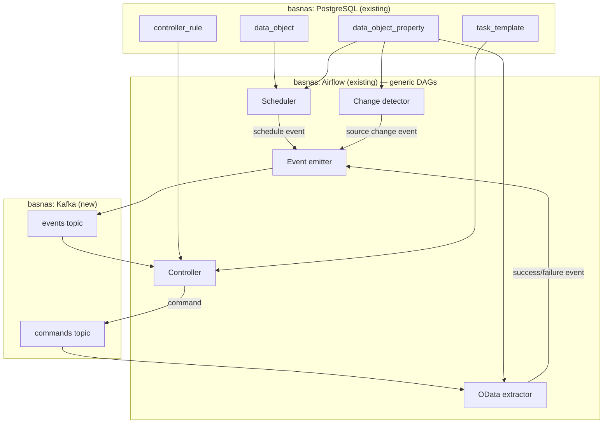

# Phase one: CBS OData extraction with event-based orchestration

## Table of contents

<!-- markdown-toc:start -->
- [Goal](#goal)
- [Scope](#scope)
- [Infrastructure: reuse existing services on basnas](#infrastructure-reuse-existing-services-on-basnas)
  - [Kafka setup on basnas](#kafka-setup-on-basnas)
  - [Airflow configuration](#airflow-configuration)
  - [PostgreSQL configuration](#postgresql-configuration)
- [Design principle: configuration vs generic code](#design-principle-configuration-vs-generic-code)
- [Metadata-driven architecture](#metadata-driven-architecture)
  - [What is configured in metadata](#what-is-configured-in-metadata)
  - [What is generic code](#what-is-generic-code)
- [Metadata configuration: data objects](#metadata-configuration-data-objects)
- [Metadata configuration: properties](#metadata-configuration-properties)
  - [Property definitions](#property-definitions)
  - [Property assignments (data_object_property)](#property-assignments-data_object_property)
- [Metadata configuration: task templates](#metadata-configuration-task-templates)
- [Metadata configuration: controller rules](#metadata-configuration-controller-rules)
- [Metadata configuration: scheduling](#metadata-configuration-scheduling)
- [Generic components](#generic-components)
  - [1) Scheduler (event producer)](#1-scheduler-event-producer)
  - [2) Change detector (event producer)](#2-change-detector-event-producer)
  - [3) Controller (rules engine)](#3-controller-rules-engine)
  - [4) OData extractor (task executor)](#4-odata-extractor-task-executor)
  - [5) Event emitter](#5-event-emitter)
- [Event flow](#event-flow)
- [Kafka topic design](#kafka-topic-design)
- [Airflow DAG design](#airflow-dag-design)
  - [DAG 1: scheduler_heartbeat](#dag-1-scheduler_heartbeat)
  - [DAG 2: event_controller](#dag-2-event_controller)
  - [DAG 3: task_executor_odata_v4](#dag-3-task_executor_odata_v4)
- [Rollout steps](#rollout-steps)
  - [Step 1: Database schema and seed data](#step-1-database-schema-and-seed-data)
  - [Step 2: Library — metadata client with property inheritance](#step-2-library-metadata-client-with-property-inheritance)
  - [Step 3: Library — OData client](#step-3-library-odata-client)
  - [Step 4: Library — Parquet writer](#step-4-library-parquet-writer)
  - [Step 5: Standalone extraction test (no Kafka, no Airflow)](#step-5-standalone-extraction-test-no-kafka-no-airflow)
  - [Step 6: Kafka setup and event emitter](#step-6-kafka-setup-and-event-emitter)
  - [Step 7: Change detector + scheduler heartbeat DAG](#step-7-change-detector-scheduler-heartbeat-dag)
  - [Step 8: Controller DAG](#step-8-controller-dag)
  - [Step 9: Executor DAG — end-to-end pipeline](#step-9-executor-dag-end-to-end-pipeline)
  - [Step summary](#step-summary)
- [Example: adding a new CBS dataset](#example-adding-a-new-cbs-dataset)
<!-- markdown-toc:end -->

## Goal

Build a working extraction pipeline that ingests CBS (Statistics Netherlands) OData datasets using the event-based orchestration pattern, where all behavior is driven by metadata configuration and the code remains fully generic and reusable.

## Scope

Phase one delivers:

- Change detection for CBS OData datasets (poll `/Properties` for `Modified` date)
- Metadata-driven scheduling, triggering, and extraction
- Landing raw data as Parquet files
- End-to-end event trail through Kafka
- All configuration stored in the DESL data model (PostgreSQL)
- Zero code changes required to add a new dataset

Phase one does **not** include:

- Data transformation (Silver/Gold layers)
- Bitemporal history tracking (prepared for, not implemented)
- Schema discovery and drift detection
- Retry logic and dead-letter handling (Phase two)

## Infrastructure: reuse existing services on basnas

This implementation reuses the PostgreSQL and Apache Airflow instances already running on basnas. Only Kafka is added as a new service.

| Service | Location | Status | Action needed |
| --- | --- | --- | --- |
| PostgreSQL | basnas (existing) | Running | Create a new database `orchestration` with DESL schema |
| Apache Airflow | basnas (existing) | Running | Deploy new DAGs and Python libraries |
| Apache Kafka | basnas (new) | Not yet running | Add single-broker Kafka container (KRaft mode) |
| Data landing (filesystem) | basnas (existing) | Running | Create folder structure under shared storage |

### Kafka setup on basnas

A single-broker Kafka instance in KRaft mode (no ZooKeeper needed) is sufficient for Phase one. Add to the existing Docker Compose or run standalone:

```yaml
kafka:
  image: apache/kafka:3.7
  container_name: kafka
  environment:
    KAFKA_NODE_ID: 1
    KAFKA_PROCESS_ROLES: broker,controller
    KAFKA_LISTENERS: PLAINTEXT://0.0.0.0:9092,CONTROLLER://0.0.0.0:9093
    KAFKA_ADVERTISED_LISTENERS: PLAINTEXT://basnas:9092
    KAFKA_CONTROLLER_LISTENER_NAMES: CONTROLLER
    KAFKA_CONTROLLER_QUORUM_VOTERS: 1@localhost:9093
    KAFKA_LOG_RETENTION_HOURS: 168
  ports:
    - "9092:9092"
  volumes:
    - kafka-data:/var/lib/kafka/data
  restart: unless-stopped
```

### Airflow configuration

The existing Airflow instance on basnas needs:

- A new Airflow connection `postgres_orchestration` pointing to the orchestration database
- A new Airflow connection `kafka_default` pointing to `basnas:9092`
- The `apache-airflow-providers-apache-kafka` package installed
- The `lib/` folder added to the Airflow Python path (e.g. in the plugins or packages directory)

### PostgreSQL configuration

Create a dedicated database on the existing PostgreSQL instance:

```sql
CREATE DATABASE orchestration;
```

The DESL schema tables are created inside this database during step 1 of the rollout.

## Design principle: configuration vs generic code

The system follows a strict boundary: **adding a new data source, changing a schedule, or modifying trigger logic never requires a code change**. All behavior is driven by rows in the metadata store.

| Concern | Driven by | Example |
| --- | --- | --- |
| What to extract | `data_object` + `data_object_property` | CBS dataset `84583NED`, load mode `full_replace` |
| When to check for changes | `data_object_property` (schedule properties) | `polling_cron = "0 */6 * * *"` |
| What qualifies as a change | `data_object_property` (change detection properties) | `change_detection_field = "Modified"` |
| What to do when a change is detected | `controller_rule` | If event_type=`source_change` and object_type=`odata_dataset` → use task template `odata_full_extract` |
| How to execute the extraction | `task_template` | Interface type `odata_v4`, retry 3 times, backoff 60s |
| Where to land the data | `data_object_property` | `landing_path = "bronze/cbs/{object_name}/{date}"` |

## Metadata-driven architecture



### What is configured in metadata

- Which CBS datasets to monitor (object tree)
- Polling schedule per dataset or inherited from parent
- OData base URL and endpoint paths
- Change detection strategy and field name
- Landing path template
- Load mode (full replace, incremental)
- Priority and retry behavior
- Trigger rules that map events to tasks

### What is generic code

- Scheduler loop: reads schedules from metadata, emits timer events
- Change detector: reads detection config from metadata, compares with last known state, emits change events
- Controller: reads rules from metadata, matches events, creates commands
- OData extractor: reads connection config from metadata, paginates through OData, writes Parquet
- Event emitter: produces structured events to Kafka

## Metadata configuration: data objects

The object tree represents the CBS source hierarchy. Registering a new dataset means inserting rows here.

```
cbs (root, object_type: "server")
├── odata-v1 (object_type: "database", represents the API version)
│   ├── 84583NED (object_type: "schema", represents a dataset)
│   │   ├── Observations (object_type: "table")
│   │   ├── RegioSCodes (object_type: "table")
│   │   └── PeriodenCodes (object_type: "table")
│   ├── 84669NED (object_type: "schema")
│   │   ├── Observations (object_type: "table")
│   │   └── ...
│   └── 85523NED (object_type: "schema")
│       └── ...
```

Example `data_object` rows:

| data_object_id | object_type | object_name | object_path | parent_data_object_id |
| --- | --- | --- | --- | --- |
| 1 | server | cbs | cbs | NULL |
| 2 | database | odata-v1 | cbs/odata-v1 | 1 |
| 3 | schema | 84583NED | cbs/odata-v1/84583NED | 2 |
| 4 | table | Observations | cbs/odata-v1/84583NED/Observations | 3 |
| 5 | table | RegioSCodes | cbs/odata-v1/84583NED/RegioSCodes | 3 |

## Metadata configuration: properties

Properties are inherited down the object tree. Configure once at the `cbs` level, override per dataset where needed.

### Property definitions

| property_id | property_name | data_type | default_value | root_object_type | levels_deep |
| --- | --- | --- | --- | --- | --- |
| 1 | ingestion_enabled | boolean | false | server | 4 |
| 2 | polling_cron | string | NULL | server | 4 |
| 3 | base_url | string | NULL | server | 4 |
| 4 | change_detection_field | string | Modified | server | 4 |
| 5 | change_detection_endpoint | string | Properties | server | 4 |
| 6 | load_mode | string | full_replace | server | 4 |
| 7 | landing_path_template | string | NULL | server | 4 |
| 8 | odata_page_size | string | 10000 | server | 4 |
| 9 | last_known_modified | string | NULL | schema | 1 |

### Property assignments (data_object_property)

| data_object_id | property_name | property_value | inherited_from | is_override |
| --- | --- | --- | --- | --- |
| 1 (cbs) | ingestion_enabled | true | NULL | false |
| 1 (cbs) | polling_cron | 0 */6 * * * | NULL | false |
| 1 (cbs) | base_url | https://datasets.cbs.nl/odata/v1/CBS | NULL | false |
| 1 (cbs) | change_detection_field | Modified | NULL | false |
| 1 (cbs) | change_detection_endpoint | Properties | NULL | false |
| 1 (cbs) | load_mode | full_replace | NULL | false |
| 1 (cbs) | landing_path_template | /data/bronze/cbs/{object_name}/{date} | NULL | false |
| 3 (84583NED) | polling_cron | 0 8 * * 1 | NULL | true |
| 3 (84583NED) | last_known_modified | 2026-04-01 | NULL | false |

In this example, dataset `84583NED` overrides the default polling to weekly Monday 08:00 because it updates less frequently. All other datasets inherit the 6-hourly schedule from the `cbs` root.

## Metadata configuration: task templates

Task templates define the generic execution blueprint. For Phase one there is one template for OData extraction.

| task_template_id | task_template_name | interface_type | retry_max_attempts | retry_backoff_seconds | idempotency_key_strategy |
| --- | --- | --- | --- | --- | --- |
| 1 | odata_full_extract | odata_v4 | 3 | 60 | source_object + modified_date |
| 2 | odata_dimension_extract | odata_v4 | 3 | 30 | source_object + modified_date |

The `interface_type` tells the generic executor which adapter to use. In Phase one, only `odata_v4` exists. Future phases add `jdbc`, `file_sftp`, `rest_api`, etc.

## Metadata configuration: controller rules

Controller rules map events to task templates. The controller evaluates these rules whenever a new event arrives.

| controller_rule_id | rule_name | filter_event_type | filter_event_status | filter_object_type | task_template_id | priority | is_active |
| --- | --- | --- | --- | --- | --- | --- | --- |
| 1 | ingest_on_source_change | source_change | end_successful | schema | 1 | 100 | true |
| 2 | ingest_dimensions_on_source_change | source_change | end_successful | schema | 2 | 200 | true |

Rule 1: When a `source_change` event completes successfully for any object of type `schema` (i.e. a CBS dataset), queue a full OData extraction task.

Rule 2: Same trigger, but queues a dimension extraction task at lower priority.

Adding a new trigger for a different event type (e.g. manual refresh, or error retry) is another row — no code change.

## Metadata configuration: scheduling

Scheduling is a property, not hardcoded in Airflow DAGs. The generic scheduler reads all objects with `ingestion_enabled = true` and a `polling_cron` property, then decides which datasets need checking based on the current time.

This means:

- Changing a schedule = updating a property value
- Disabling a dataset = setting `ingestion_enabled = false`
- Adding a new dataset with a different schedule = inserting object + property rows

The Airflow DAG that implements the scheduler runs on a **fixed high-frequency heartbeat** (e.g. every 5 minutes) and checks which datasets are due based on their configured cron expression and last poll timestamp.

## Generic components

### 1) Scheduler (event producer)

**Purpose:** Determine which datasets are due for a change-detection check based on their configured `polling_cron`.

**Behavior:**
1. Query metadata: all objects where `ingestion_enabled = true` and `polling_cron` is set
2. For each object, evaluate the cron expression against the last check timestamp
3. If due, invoke the change detector for that object
4. The scheduler itself does not know about CBS, OData, or any specific source

### 2) Change detector (event producer)

**Purpose:** Compare the current state of a source with the last known state. Emit an event if something changed.

**Behavior:**
1. Read properties from metadata: `base_url`, `change_detection_endpoint`, `change_detection_field`, `last_known_modified`
2. Call `{base_url}/{object_name}/{change_detection_endpoint}`
3. Extract the field specified by `change_detection_field` from the response
4. Compare with `last_known_modified`
5. If different: emit a `source_change` event to Kafka and update `last_known_modified` in metadata
6. If same: no action

The change detector is generic. It does not know it is talking to CBS. It constructs the URL and field from metadata.

### 3) Controller (rules engine)

**Purpose:** Match incoming events against configured rules and create task commands.

**Behavior:**
1. Consume events from the Kafka `events` topic
2. For each event, query `controller_rule` where all non-null filters match the event attributes
3. For each matching rule, create a command on the Kafka `commands` topic with the `task_template_id` and event context
4. Update controller checkpoint

The controller is entirely generic. It knows nothing about CBS or OData.

### 4) OData extractor (task executor)

**Purpose:** Execute an OData extraction task based on the command and metadata configuration.

**Behavior:**
1. Consume commands from the Kafka `commands` topic where `interface_type = odata_v4`
2. Resolve the target object from the command's context
3. Read properties: `base_url`, `landing_path_template`, `odata_page_size`, `load_mode`
4. Construct the OData URL: `{base_url}/{dataset_name}/{table_name}`
5. Paginate through results using `@odata.nextLink`
6. Write results as Parquet to the resolved `landing_path_template`
7. Emit a success or failure event

The extractor is a generic OData v4 client. It works with any OData source configured in the metadata, not just CBS.

### 5) Event emitter

**Purpose:** Provide a consistent interface for producing events to Kafka with proper envelope structure.

**Behavior:**
1. Accept event parameters (type, status, object info, payload)
2. Generate `event_id`, `correlation_id`, `idempotency_key`
3. Produce to Kafka `events` topic with the standard envelope
4. Write a copy to the `event` table in PostgreSQL for queryability

## Event flow

```
┌─────────────────────────────────────────────────────────────────────────────┐
│ Complete flow for a single CBS dataset refresh                              │
├─────────────────────────────────────────────────────────────────────────────┤
│                                                                             │
│  1. Scheduler heartbeat fires (Airflow on basnas, every 5 min)              │
│     → Reads metadata: "84583NED has polling_cron='0 */6 * * *'"             │
│     → Evaluates: last check was 6h+ ago → due now                           │
│                                                                             │
│  2. Change detector invoked for 84583NED                                    │
│     → Reads metadata: base_url, change_detection_endpoint, field            │
│     → GET https://datasets.cbs.nl/odata/v1/CBS/84583NED/Properties          │
│     → Response: { "Modified": "2026-05-10" }                                │
│     → Metadata says last_known_modified = "2026-04-10"                      │
│     → CHANGED! Emit event:                                                  │
│                                                                             │
│  3. Event emitted to Kafka on basnas (events topic):                        │
│     {                                                                       │
│       event_type: "source_change",                                          │
│       event_status: "end_successful",                                       │
│       object_type: "schema",                                                │
│       object_name: "84583NED",                                              │
│       object_path: "cbs/odata-v1/84583NED",                                 │
│       container_name: "cbs",                                                │
│       idempotency_key: "cbs-84583NED-2026-05-10"                            │
│     }                                                                       │
│                                                                             │
│  4. Controller consumes event                                               │
│     → Matches controller_rule: filter_event_type="source_change",           │
│       filter_event_status="end_successful", filter_object_type="schema"     │
│     → Match found! task_template_id=1 (odata_full_extract)                  │
│     → Produces command to Kafka (commands topic)                             │
│                                                                             │
│  5. OData extractor consumes command                                        │
│     → Reads metadata for 84583NED: base_url, landing_path_template          │
│     → Iterates child objects of type "table":                               │
│       Observations, RegioSCodes, PeriodenCodes                              │
│     → For each: paginate OData, write Parquet to /data/bronze/cbs/...       │
│     → Emits success event per table                                         │
│                                                                             │
│  6. Success events land on Kafka (events topic):                            │
│     { event_type: "write", event_status: "end_successful",                  │
│       object_type: "table", object_name: "Observations", ... }              │
│                                                                             │
└─────────────────────────────────────────────────────────────────────────────┘
```

## Kafka topic design

| Topic | Purpose | Key | Retention |
| --- | --- | --- | --- |
| `orchestration.events` | All events (schedule ticks, source changes, task lifecycle) | `object_path` | 7 days |
| `orchestration.commands` | Task commands from controller to executors | `task_template_id` | 3 days |

Event envelope (aligned with DESL `event` entity):

```json
{
  "event_id": "uuid",
  "event_timestamp": "2026-05-11T06:00:12Z",
  "event_type": "source_change",
  "event_status": "end_successful",
  "object_type": "schema",
  "object_name": "84583NED",
  "object_path": "cbs/odata-v1/84583NED",
  "container_type": "server",
  "container_name": "cbs",
  "correlation_id": "uuid",
  "idempotency_key": "cbs-84583NED-2026-05-10",
  "payload": {
    "previous_modified": "2026-04-10",
    "current_modified": "2026-05-10"
  }
}
```

Command envelope:

```json
{
  "command_id": "uuid",
  "task_template_id": 1,
  "task_template_name": "odata_full_extract",
  "interface_type": "odata_v4",
  "source_event_id": "uuid",
  "correlation_id": "uuid",
  "idempotency_key": "cbs-84583NED-2026-05-10",
  "priority": 100,
  "target_object_path": "cbs/odata-v1/84583NED"
}
```

## Airflow DAG design

Airflow is used **only** as the execution runtime. It does not contain business logic or configuration. All DAGs are generic and short.

### DAG 1: `scheduler_heartbeat`

```
Schedule:   */5 * * * * (every 5 minutes)
Purpose:    Check which datasets are due for polling based on metadata
Contains:   No source-specific logic
```

Tasks:
1. `query_due_datasets` — Read metadata, evaluate cron expressions, return list of due object_paths
2. `run_change_detection` — For each due dataset, invoke the change detector (dynamic task mapping)

### DAG 2: `event_controller`

```
Schedule:   Triggered by KafkaSensor on orchestration.events topic
Purpose:    Match events to rules, produce commands
Contains:   No source-specific logic
```

Tasks:
1. `consume_event` — Read event from Kafka
2. `evaluate_rules` — Query controller_rule table for matches
3. `produce_commands` — Write commands to Kafka commands topic

### DAG 3: `task_executor_odata_v4`

```
Schedule:   Triggered by KafkaSensor on orchestration.commands (filtered by interface_type)
Purpose:    Execute OData extraction based on command + metadata
Contains:   Generic OData v4 logic (pagination, Parquet writing)
```

Tasks:
1. `consume_command` — Read command from Kafka
2. `resolve_configuration` — Read all properties for the target object from metadata
3. `extract_data` — Paginate OData endpoint, write Parquet to landing path
4. `emit_result_event` — Produce success or failure event to Kafka

Key design: when a new `interface_type` is needed (e.g. `jdbc`, `rest_api`), a new executor DAG is added. The controller and scheduler remain unchanged.

```
implementation/
└── cbs-odata-extraction/
    ├── README.md
    │
    ├── metadata/                       # Configuration (SQL seed scripts)
    │   ├── 01-schema.sql              # DESL tables (from desl.schema.yaml)
    │   ├── 02-seed-properties.sql     # Property definitions
    │   ├── 03-seed-cbs-objects.sql    # CBS object tree
    │   ├── 04-seed-cbs-properties.sql # CBS property assignments
    │   ├── 05-seed-task-templates.sql # Task template definitions
    │   └── 06-seed-controller-rules.sql # Controller rules
    │
    ├── dags/                           # Airflow DAGs (generic, no CBS logic)
    │   ├── scheduler_heartbeat.py
    │   ├── event_controller.py
    │   └── task_executor_odata_v4.py
    │
    ├── lib/                            # Shared generic Python code
    │   ├── metadata_client.py         # Read objects, properties, rules from PostgreSQL
    │   ├── event_emitter.py           # Produce events to Kafka
    │   ├── change_detector.py         # Generic change detection logic
    │   ├── odata_client.py            # Generic OData v4 paginator
    │   ├── cron_evaluator.py          # Evaluate cron expressions against timestamps
    │   └── parquet_writer.py          # Write DataFrames to Parquet with partitioning
    │
    ├── schemas/                        # Kafka event/command JSON Schemas
    │   ├── event-envelope.json
    │   └── command-envelope.json
    │
    └── tests/
        ├── test_change_detector.py
        ├── test_controller.py
        ├── test_odata_client.py
        └── test_cron_evaluator.py
```

Key observations:

- **`metadata/`** is the only folder that mentions CBS. Everything else is generic.
- **`dags/`** contain no source-specific logic. They orchestrate generic components.
- **`lib/`** contains reusable components driven entirely by metadata parameters.
- Adding a new source (e.g. World Bank API) means adding SQL seed files — zero code changes.

## Rollout steps

Each step is independently deployable and testable. Complete one step, verify it works, then move to the next.

### Step 1: Database schema and seed data

**What:** Create the `orchestration` database on basnas PostgreSQL and populate it with the DESL schema and CBS configuration.

**Actions:**
1. Run `01-schema.sql` to create all tables
2. Run `02-seed-properties.sql` through `06-seed-controller-rules.sql` to insert CBS configuration
3. Verify with a query: `SELECT * FROM data_object WHERE object_path LIKE 'cbs/%'`

**Done when:** The metadata store contains the full CBS object tree, properties, task templates, and controller rules.

### Step 2: Library — metadata client with property inheritance

**What:** Build `metadata_client.py` that reads objects and resolves inherited properties.

**Actions:**
1. Implement `get_objects_with_property(property_name, value)` — returns objects where the resolved property matches
2. Implement `get_resolved_properties(object_path)` — returns all properties for an object, with inheritance applied
3. Implement `update_property(object_path, property_name, value)` — update a single property value
4. Write unit tests against the seeded database

**Done when:** You can call `get_resolved_properties("cbs/odata-v1/84583NED")` and get back the full set of inherited + overridden properties.

### Step 3: Library — OData client

**What:** Build `odata_client.py` that paginates any OData v4 endpoint and returns a DataFrame.

**Actions:**
1. Implement `fetch_odata(url, page_size)` — handles `@odata.nextLink` pagination
2. Implement `fetch_singleton(url)` — fetches a single Properties record
3. Write unit tests with mocked HTTP responses
4. Manual test: call CBS `84583NED/Properties` and `84583NED/Observations` (first page)

**Done when:** You can fetch a full CBS dataset as a pandas DataFrame from Python.

### Step 4: Library — Parquet writer

**What:** Build `parquet_writer.py` that writes a DataFrame to a templated path on basnas shared storage.

**Actions:**
1. Implement `write_parquet(df, path_template, template_vars)` — resolves template and writes file
2. Template variables: `{object_name}`, `{date}`, `{timestamp}`
3. Write to basnas shared storage path (e.g. `/data/bronze/...`)

**Done when:** You can write a DataFrame to `/data/bronze/cbs/84583NED/2026-05-11.parquet` on basnas.

### Step 5: Standalone extraction test (no Kafka, no Airflow)

**What:** Run the complete extraction flow as a standalone Python script to prove the components work together.

**Actions:**
1. Script reads metadata for one dataset
2. Calls OData client to check `Modified` date
3. If changed: downloads Observations, writes Parquet
4. Verify the Parquet file on disk

**Done when:** A CBS dataset is successfully extracted to Parquet on basnas, driven by metadata configuration, without Airflow or Kafka.

### Step 6: Kafka setup and event emitter

**What:** Deploy Kafka on basnas and build the event emitter library.

**Actions:**
1. Start Kafka container on basnas (single broker, KRaft mode)
2. Create topics: `orchestration.events`, `orchestration.commands`
3. Implement `event_emitter.py` — produces events to Kafka and writes to PostgreSQL `event` table
4. Test: emit a sample event and verify it arrives on the topic and in the database

**Done when:** Events can be produced and consumed on Kafka, and are persisted in PostgreSQL.

### Step 7: Change detector + scheduler heartbeat DAG

**What:** Deploy the first Airflow DAG that polls CBS datasets on their configured schedule.

**Actions:**
1. Implement `change_detector.py` — uses metadata client + OData client + event emitter
2. Implement `cron_evaluator.py` — checks if an object is due based on `polling_cron` and last check time
3. Create `scheduler_heartbeat` DAG — runs every 5 minutes, checks due datasets, runs change detection
4. Deploy DAG to basnas Airflow
5. Configure Airflow connections (`postgres_orchestration`, `kafka_default`)

**Done when:** Airflow automatically polls CBS datasets on their configured schedule and emits change events to Kafka when a dataset has been updated.

### Step 8: Controller DAG

**What:** Deploy the controller that matches events to rules and produces commands.

**Actions:**
1. Create `event_controller` DAG — KafkaSensor on `orchestration.events`, evaluates rules, produces commands
2. Deploy to basnas Airflow
3. Test: trigger a manual change event and verify a command appears on `orchestration.commands`

**Done when:** A change event on Kafka automatically results in an extraction command on the commands topic.

### Step 9: Executor DAG — end-to-end pipeline

**What:** Deploy the OData executor that completes the pipeline.

**Actions:**
1. Create `task_executor_odata_v4` DAG — KafkaSensor on `orchestration.commands`, extracts data, emits result event
2. Deploy to basnas Airflow
3. End-to-end test: wait for CBS to update, or manually emit a change event, and verify:
   - Command is created by controller
   - Executor downloads data
   - Parquet file lands on basnas storage
   - Success event is emitted

**Done when:** The full event-based orchestration cycle runs autonomously on basnas. A CBS dataset update is automatically detected, triggers an extraction, and lands data as Parquet.

### Step summary

| Step | Builds on | What you can verify |
| --- | --- | --- |
| 1. Database schema + seed | — | Metadata is queryable |
| 2. Metadata client | Step 1 | Property inheritance works |
| 3. OData client | — | CBS data is fetchable |
| 4. Parquet writer | — | Files land on basnas storage |
| 5. Standalone extraction | Steps 1-4 | End-to-end extraction without infrastructure |
| 6. Kafka + event emitter | — | Events flow through Kafka |
| 7. Change detector DAG | Steps 1-6 | Airflow detects CBS changes automatically |
| 8. Controller DAG | Steps 6-7 | Events are routed to commands |
| 9. Executor DAG | Steps 6-8 | Full autonomous pipeline running |

## Example: adding a new CBS dataset

To add dataset `37296ned` (Kerncijfers gemeenten) to the pipeline, an operator inserts metadata rows. No code is changed, no DAG is modified, no deployment is needed.

**Step 1: Register the object tree**

```sql
INSERT INTO data_object (object_type, object_name, object_path, parent_data_object_id)
VALUES
  ('schema', '37296ned', 'cbs/odata-v1/37296ned', 2),
  ('table', 'Observations', 'cbs/odata-v1/37296ned/Observations', CURRVAL('data_object_id_seq')),
  ('table', 'RegioSCodes', 'cbs/odata-v1/37296ned/RegioSCodes', CURRVAL('data_object_id_seq'));
```

**Step 2: (Optional) Override any properties**

```sql
-- Only needed if this dataset deviates from the inherited defaults
INSERT INTO data_object_property (data_object_id, property_id, property_value, is_override)
VALUES
  (NEW_ID, 2, '0 0 1 * *', true);  -- Monthly polling instead of 6-hourly
```

**Step 3: Done**

The next scheduler heartbeat will:
1. See the new dataset (inherits `ingestion_enabled = true` from `cbs` root)
2. Evaluate its `polling_cron` (inherited `0 */6 * * *` or overridden `0 0 1 * *`)
3. Run change detection when due
4. If CBS has data, emit event → controller matches rule → extractor runs

No restart, no redeployment, no code change.

## Project structure

<!-- markdown-project-structure:start -->
- [Data Solution 2026](readme.md)
  - Classifications
  - Configurations
  - Connections
    - Sources
  - Conventions
  - Dataobjectmappings
    - 000_Source
      - Knmi
        - Roelant
    - Persistentstaging
    - Staging
  - Dataobjects
    - 000_Source
      - Dbo
    - 100_Landing_Area
      - Dbo
    - 150_Persistent_Staging_Area
      - Dbo
  - Docs
    - [Markdown automation](docs/markdown-automation.md)
  - Extractors
    - Common
    - Odata
    - Wfs
  - Perspectives
  - Schemas
    - [Schema follow-ups](Schemas/follow-ups.md)
  - Settings
  - Templates
    - Dataobjectmappinglists
      - [Landing Area Stored Procedure Delta](Templates/DataObjectMappingLists/LandingSqlServerStoredProcedureDelta.handlebars.md)
      - [Landing Area Stored Procedure Landing](Templates/DataObjectMappingLists/LandingSqlServerStoredProcedureLanding.handlebars.md)
      - [Persistent Staging Area Stored Procedure Delta](Templates/DataObjectMappingLists/PersistentStagingSqlServerStoredProcedureDelta.handlebars.md)
      - [Persistent Staging Area Stored Procedure Full Outer Join](Templates/DataObjectMappingLists/PersistentStagingSqlServerStoredProcedureFullOuterJoin.handlebars.md)
    - Dataobjects
      - [Source Area Generate Table](Templates/DataObjects/CreatePhysicalDataObject.handlebars.md)
      - [Landing Area Generate Table](Templates/DataObjects/LandingSqlServerGenerateTable.handlebars.md)
      - [Persistent Staging Area Generate Table](Templates/DataObjects/PersistentStagingSqlServerGenerateTable.handlebars.md)
      - [Source Area Generate Table](Templates/DataObjects/SourceSqlServerGenerateTable.handlebars.md)
    - Other
      - [Deployment](Templates/Other/Container.handlebars.md)
      - [Control Framework Registration](Templates/Other/ControlFrameworkRegistration.handlebars.md)
      - [Databases](Templates/Other/Databases.handlebars.md)
      - [Deployment](Templates/Other/Deployment.handlebars.md)
      - [Documentation](Templates/Other/Documentation.handlebars.md)
      - [Readme](Templates/Other/Readme.handlebars.md)
      - [Sample Data - SaveMore Source System](Templates/Other/SampleDataSqlServer.handlebars.md)
  - [Phase one: CBS OData extraction with event-based orchestration](plan1.md)
  - [Phase two: minimal Dutch government OData ingestion with event-based orchestration](plan2.md)
  - [Phase three: JSON-configured Dutch government OData ingestion](plan3.md)
- Related repositories
  - [cursor-config](https://github.com/basvdberg/cursor-config)
  - [Data Engineering 2026](https://github.com/basvdberg/data-engineering-2026)
  - [Data Engineering Design Patterns](https://github.com/basvdberg/data-engineering-design-patterns)
<!-- markdown-project-structure:end -->
