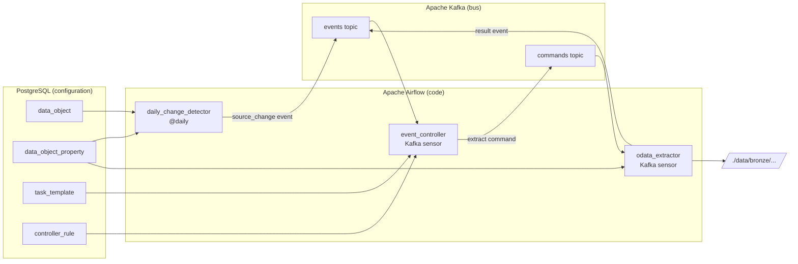

# Phase two: minimal Dutch government OData ingestion with event-based orchestration

## Table of contents

<!-- markdown-toc:start -->
- [Goal](#goal)
- [Why a second plan](#why-a-second-plan)
- [Scope](#scope)
- [Dutch government OData sources](#dutch-government-odata-sources)
- [Architecture in one picture](#architecture-in-one-picture)
- [Strict separation: code vs configuration](#strict-separation-code-vs-configuration)
- [Configuration: the Object-Property tree in PostgreSQL](#configuration-the-object-property-tree-in-postgresql)
  - [Example: data_object](#example-data_object)
  - [Example: property](#example-property)
  - [Example: data_object_property](#example-data_object_property)
  - [Example: controller_rule](#example-controller_rule)
- [Code: three generic Airflow DAGs](#code-three-generic-airflow-dags)
  - [DAG 1 — daily_change_detector](#dag-1-daily_change_detector)
  - [DAG 2 — event_controller](#dag-2-event_controller)
  - [DAG 3 — odata_extractor](#dag-3-odata_extractor)
- [Kafka topic design](#kafka-topic-design)
- [How "fetch daily, only when changed" works](#how-fetch-daily-only-when-changed-works)
- [Rollout plan](#rollout-plan)
  - [Step 1 — Local stack](#step-1-local-stack)
  - [Step 2 — Database schema and CBS seed](#step-2-database-schema-and-cbs-seed)
  - [Step 3 — Generic library](#step-3-generic-library)
  - [Step 4 — Daily change detector DAG](#step-4-daily-change-detector-dag)
  - [Step 5 — Event controller DAG](#step-5-event-controller-dag)
  - [Step 6 — OData extractor DAG and end-to-end demo](#step-6-odata-extractor-dag-and-end-to-end-demo)
  - [Step summary](#step-summary)
- [Adding a new dataset (configuration-only)](#adding-a-new-dataset-configuration-only)
<!-- markdown-toc:end -->

## Goal

Build the smallest possible working implementation of the [event-based orchestration](../data-engineering-design-patterns/design-patterns/event-based-orchestration.md) pattern that ingests free OData feeds from the Dutch government on a daily schedule, but only triggers an actual extraction when the source has changed since the previous run.

The implementation must demonstrate:

- Apache Airflow as the orchestration runtime (one DAG per role, nothing else).
- Apache Kafka as the event/command bus.
- PostgreSQL holding all configuration in the [Object-Property tree](../data-engineering-design-patterns/design-patterns/object-property-tree.md) shape (DESL schema).
- A change-on-write style daily check: every dataset is polled at most once per day; if the source's `Modified` value is identical to the last recorded value, no extraction is performed.

## Why a second plan

`plan1.md` already describes a thorough Phase one for CBS on basnas. This plan is intentionally leaner: it strips away every component that is not strictly required to prove the pattern. It is meant for a desk-top reproduction, a workshop, or a first commit before iterating toward `plan1.md`-style production maturity.

| Concern | plan1.md | plan2.md |
| --- | --- | --- |
| Scheduling | Custom 5-minute heartbeat DAG + cron evaluator library | Airflow native `schedule="@daily"` on one DAG |
| Object tree depth | 4 levels (`server > database > schema > table`) | 3 levels (`source > dataset > table`) |
| Tables seeded | Full DESL (12 entities) | DESL subset (6 entities) |
| Cron library | Custom | None — Airflow handles cadence |
| Rollout steps | 9 | 6 |

## Scope

**In scope**

- Daily change detection per dataset via the OData `Properties` endpoint.
- Event-driven extraction triggered only when the `Modified` field has changed.
- Parquet files written to a local landing folder (`./data/bronze/<source>/<dataset>/<table>/<date>.parquet`).
- All routing decisions (which event triggers which task) live in PostgreSQL tables, never in code.

**Out of scope**

- Bronze → Silver → Gold transformations.
- Bitemporal history, schema drift detection, dead-letter handling.
- Authentication or private networking (Dutch OData feeds used here are anonymous).
- Production-grade Kafka/Airflow deployment — a single Docker Compose stack is enough.

## Dutch government OData sources

The Dutch government exposes several anonymous OData v4 feeds. Each one shares the same change-detection mechanism: a per-dataset `Properties` singleton with a `Modified` timestamp. That property is what makes "only when changed" trivial.

| Source | Base URL | Example dataset | What it contains |
| --- | --- | --- | --- |
| `cbs` (Statistics Netherlands) | `https://datasets.cbs.nl/odata/v1/CBS/` | `84583NED` | Macroeconomic indicators |
| `cbs` (Statistics Netherlands) | `https://datasets.cbs.nl/odata/v1/CBS/` | `85523NED` | Population per municipality |
| `cbs` (Statistics Netherlands) | `https://datasets.cbs.nl/odata/v1/CBS/` | `37296ned` | Birth, death, migration |

The implementation is generic: any anonymous OData v4 feed exposing `<base_url>/<dataset>/Properties` with a `Modified` field plugs in by inserting metadata rows. CBS is the seed source; PDOK, RDW, and KOOP can be added later without any code change.

## Architecture in one picture



Three short DAGs, two Kafka topics, four PostgreSQL tables in active use. Nothing else.

## Strict separation: code vs configuration

A single rule governs every line written: **anything that depends on a specific source, dataset, schedule, or rule lives in the database. Anything that runs the same way for every source lives in Python.**

| Decision | Where it lives | Example |
| --- | --- | --- |
| Which sources exist | PostgreSQL `data_object` | row `('source', 'cbs')` |
| Which datasets to ingest | PostgreSQL `data_object` | row `('dataset', '84583NED')` with `ingestion_enabled=true` |
| Where to call for change detection | PostgreSQL `data_object_property` | `base_url`, `change_detection_endpoint` |
| What counts as "changed" | PostgreSQL `data_object_property` | `change_detection_field=Modified`, `last_known_modified=2026-04-01` |
| What to do on a change event | PostgreSQL `controller_rule` | row mapping `source_change` → `task_template=odata_extract` |
| How to run the OData call | Python `lib/odata_client.py` | identical for every dataset |
| How to write Parquet | Python `lib/parquet_writer.py` | identical for every dataset |
| When to check | Airflow `schedule="@daily"` on `daily_change_detector` | identical for every dataset |

Adding a new Dutch government OData feed never modifies any `.py` file.

## Configuration: the Object-Property tree in PostgreSQL

A DESL subset is enough. The schema files in `implementation/data-model/desl.schema.yaml` already define these entities — plan2 only needs the following six.

| Table | Role in plan2 |
| --- | --- |
| `data_object` | The source/dataset/table tree |
| `property` | Property catalogue (e.g. `base_url`, `change_detection_field`) |
| `data_object_property` | Property assignments per object (inherited or overridden) |
| `task_template` | One row: `odata_extract` |
| `controller_rule` | One row: `source_change` → `odata_extract` |
| `event` | Persistent copy of every event for replay and inspection |

### Example: `data_object`

| data_object_id | object_type | object_name | object_path | parent |
| --- | --- | --- | --- | --- |
| 1 | source | cbs | cbs | NULL |
| 2 | dataset | 84583NED | cbs/84583NED | 1 |
| 3 | table | Observations | cbs/84583NED/Observations | 2 |
| 4 | table | RegioSCodes | cbs/84583NED/RegioSCodes | 2 |

### Example: `property`

| property_name | data_type | default_value | root_object_type |
| --- | --- | --- | --- |
| `ingestion_enabled` | boolean | `false` | source |
| `base_url` | string | NULL | source |
| `change_detection_endpoint` | string | `Properties` | source |
| `change_detection_field` | string | `Modified` | source |
| `landing_path_template` | string | `./data/bronze/{source}/{dataset}/{table}/{date}` | source |
| `odata_page_size` | int | `10000` | source |
| `last_known_modified` | string | NULL | dataset |

### Example: `data_object_property`

Properties set once at the `cbs` source level cascade to every dataset and every table beneath it. The dataset-level `last_known_modified` is the only value that the system writes back to the database during normal operation.

| object_path | property_name | property_value | is_override |
| --- | --- | --- | --- |
| `cbs` | `ingestion_enabled` | `true` | false |
| `cbs` | `base_url` | `https://datasets.cbs.nl/odata/v1/CBS` | false |
| `cbs/84583NED` | `last_known_modified` | `2026-04-01` | false |

### Example: `controller_rule`

A single row drives the entire pipeline:

| rule_name | filter_event_type | filter_object_type | task_template | priority |
| --- | --- | --- | --- | --- |
| `ingest_on_change` | `source_change` | `dataset` | `odata_extract` | 100 |

## Code: three generic Airflow DAGs

Each DAG is a thin wrapper around a small library function. None of them contains source-specific logic.

### DAG 1 — `daily_change_detector`

```text
schedule: @daily
purpose:  call /Properties for each enabled dataset, compare Modified
          with last_known_modified, emit source_change event on Kafka
          if (and only if) the value changed.
```

Body, in essence:

```python
from lib import metadata, odata, events

def detect_changes():
    for ds in metadata.list_enabled_datasets():
        props = metadata.resolve_properties(ds.object_path)
        current = odata.fetch_singleton(
            f"{props['base_url']}/{ds.object_name}/{props['change_detection_endpoint']}"
        )[props["change_detection_field"]]
        if current != props.get("last_known_modified"):
            events.emit(
                event_type="source_change",
                event_status="end_successful",
                object_type="dataset",
                object_name=ds.object_name,
                object_path=ds.object_path,
                payload={"previous": props.get("last_known_modified"),
                         "current":  current},
            )
            metadata.update_property(ds.object_path, "last_known_modified", current)
```

### DAG 2 — `event_controller`

```text
schedule: triggered by AwaitMessageTriggerFunctionSensor on `events` topic
purpose:  match each event against controller_rule rows and publish a
          command on the `commands` topic.
```

Body:

```python
from lib import metadata, commands

def route(event):
    for rule in metadata.matching_rules(event):
        commands.emit(
            task_template_id=rule.task_template_id,
            target_object_path=event["object_path"],
            correlation_id=event["correlation_id"],
        )
```

### DAG 3 — `odata_extractor`

```text
schedule: triggered by AwaitMessageTriggerFunctionSensor on `commands` topic
          filtered by interface_type = odata_v4
purpose:  paginate every child table of the target dataset and write Parquet.
```

Body:

```python
from lib import metadata, odata, parquet, events

def extract(command):
    dataset_path = command["target_object_path"]
    props = metadata.resolve_properties(dataset_path)
    for table in metadata.list_children(dataset_path, object_type="table"):
        df = odata.fetch_all(
            f"{props['base_url']}/{table.object_name}",
            page_size=int(props["odata_page_size"]),
        )
        parquet.write(df, props["landing_path_template"], {
            "source":  dataset_path.split("/")[0],
            "dataset": dataset_path.split("/")[1],
            "table":   table.object_name,
            "date":    today_iso(),
        })
        events.emit(event_type="write", event_status="end_successful",
                    object_type="table", object_path=table.object_path)
```

That is the complete behaviour. Everything specific to CBS (URLs, dataset IDs, schedules, what counts as a change) lives in PostgreSQL.

## Kafka topic design

| Topic | Key | Retention | Purpose |
| --- | --- | --- | --- |
| `orchestration.events` | `object_path` | 7 days | All events: change detected, extraction succeeded/failed |
| `orchestration.commands` | `task_template_id` | 3 days | Commands from controller to executor |

A single Docker Compose Kafka broker in KRaft mode is sufficient. No schema registry, no Connect cluster, no Streams.

## How "fetch daily, only when changed" works

```text
00:00 UTC      Airflow fires daily_change_detector
               │
               ▼
For each enabled dataset:
   GET https://datasets.cbs.nl/odata/v1/CBS/84583NED/Properties
   →  { "Modified": "2026-05-10T08:00:00Z" }

   SELECT property_value FROM data_object_property
   WHERE object_path = 'cbs/84583NED' AND property_name = 'last_known_modified';
   →  '2026-04-10T08:00:00Z'

   Different ⇒ produce event:
     { event_type: "source_change",
       object_path: "cbs/84583NED",
       payload: { previous: "2026-04-10...", current: "2026-05-10..." } }

   UPDATE data_object_property SET property_value = '2026-05-10T08:00:00Z'
   WHERE object_path = 'cbs/84583NED' AND property_name = 'last_known_modified';

event_controller consumes the event, finds the single controller_rule
match, publishes a command:
     { task_template: "odata_extract", target: "cbs/84583NED" }

odata_extractor consumes the command, downloads each child table,
writes Parquet, emits a `write` / `end_successful` event.
```

When CBS has not updated, the `Properties` call returns the same `Modified` value, no event is produced, and nothing else happens. The cost of a no-op day is one HTTP call per dataset.

```text
implementation/dutch-odata-extraction/
├── README.md
├── docker-compose.yml              # postgres + kafka + airflow (3 services)
│
├── metadata/                       # configuration (SQL seeds)
│   ├── 01-schema.sql               # DESL subset (6 tables)
│   ├── 02-properties.sql           # property catalogue
│   ├── 03-cbs-objects.sql          # CBS source + datasets + tables
│   ├── 04-cbs-property-values.sql  # base_url, last_known_modified, ...
│   ├── 05-task-templates.sql       # odata_extract
│   └── 06-controller-rules.sql     # source_change → odata_extract
│
├── dags/                           # code (generic, no source names appear here)
│   ├── daily_change_detector.py
│   ├── event_controller.py
│   └── odata_extractor.py
│
└── lib/                            # code (generic helpers)
    ├── metadata.py                 # property inheritance, object queries
    ├── odata.py                    # paginate any OData v4 endpoint
    ├── parquet.py                  # write a DataFrame to templated path
    ├── events.py                   # produce/consume on `events` topic
    └── commands.py                 # produce/consume on `commands` topic
```

The `metadata/` folder is the only place where the word `cbs` appears. The `dags/` and `lib/` folders are reusable for any anonymous OData v4 source.

## Rollout plan

Six steps, each independently demoable. Stop at any step and you have something working that you can show.

### Step 1 — Local stack

**Goal:** PostgreSQL, Kafka, and Airflow running locally via Docker Compose.

**Actions**

1. Write `docker-compose.yml` with three services: `postgres:16`, `apache/kafka:3.7` (KRaft, single broker), `apache/airflow:2.9-python3.11`.
2. Mount `./dags` and `./lib` into the Airflow container.
3. Add Airflow connections `postgres_orchestration` and `kafka_default`.
4. Install `apache-airflow-providers-apache-kafka`, `requests`, `pandas`, `pyarrow`, `psycopg[binary]`.

**Done when** `docker compose up` produces a healthy Airflow UI, an empty Postgres `orchestration` database, and Kafka topics `orchestration.events` and `orchestration.commands` can be created with `kafka-topics.sh`.

### Step 2 — Database schema and CBS seed

**Goal:** Configuration exists in PostgreSQL; no Python yet.

**Actions**

1. Run `metadata/01-schema.sql` to create the six DESL tables.
2. Run `metadata/02-properties.sql` through `metadata/06-controller-rules.sql` to populate the property catalogue, the CBS object tree, the property values, the single task template, and the single controller rule.
3. Verify with `SELECT object_path, object_type FROM data_object` and a JOIN that shows resolved properties for `cbs/84583NED`.

**Done when** a `SELECT ...` query against `data_object_property` returns the full effective property set (inherited + dataset overrides) for any seeded dataset.

### Step 3 — Generic library

**Goal:** Four small library modules, each fully testable in isolation against the seeded database and a mocked HTTP client.

**Actions**

1. `lib/metadata.py` — `resolve_properties(object_path)`, `list_enabled_datasets()`, `list_children(path, object_type)`, `update_property(...)`, `matching_rules(event)`.
2. `lib/odata.py` — `fetch_singleton(url)`, `fetch_all(url, page_size)`. Handles `@odata.nextLink`.
3. `lib/parquet.py` — `write(df, template, vars)`.
4. `lib/events.py` and `lib/commands.py` — thin wrappers around `KafkaProducer` and a helper that also INSERTs into the `event` table for replay.

**Done when** a Python script `python -m lib.metadata cbs/84583NED` prints the resolved property dict, and a unit test against a mocked HTTP server downloads a small CBS dataset.

### Step 4 — Daily change detector DAG

**Goal:** Daily Airflow run that emits Kafka events when CBS data has changed.

**Actions**

1. Implement `dags/daily_change_detector.py` with `schedule="@daily"` and a single PythonOperator calling `detect_changes()`.
2. Manually trigger the DAG in the Airflow UI.
3. Inspect `kafka-console-consumer.sh --topic orchestration.events`. Expect one `source_change` event per dataset whose `last_known_modified` seed value differs from CBS today.
4. Verify the `last_known_modified` rows in PostgreSQL have been updated.

**Done when** a manual run produces events on Kafka and a second run (immediately after) produces zero events.

### Step 5 — Event controller DAG

**Goal:** Events on `orchestration.events` automatically become commands on `orchestration.commands`.

**Actions**

1. Implement `dags/event_controller.py` using `AwaitMessageTriggerFunctionSensor` on `orchestration.events`.
2. The callback evaluates `controller_rule` and publishes a command per matching rule.
3. Verify with `kafka-console-consumer.sh --topic orchestration.commands` after step 4 has been triggered.

**Done when** every `source_change` event in step 4 is followed by exactly one command on the commands topic.

### Step 6 — OData extractor DAG and end-to-end demo

**Goal:** A change in CBS leads to Parquet files on disk, all autonomously.

**Actions**

1. Implement `dags/odata_extractor.py` using `AwaitMessageTriggerFunctionSensor` on `orchestration.commands`.
2. The callback resolves properties for the target dataset, downloads every child table via `lib/odata.fetch_all`, writes Parquet via `lib/parquet.write`, and emits a `write` / `end_successful` event per table.
3. Demo: rewind `last_known_modified` for one dataset (`UPDATE data_object_property SET property_value = '1900-01-01' ...`), trigger `daily_change_detector` manually, and watch Parquet files appear under `./data/bronze/cbs/84583NED/`.

**Done when** the full chain — change detected → event → command → extraction → Parquet on disk → success event — runs without any human intervention beyond the initial trigger.

### Step summary

| Step | What works at the end |
| --- | --- |
| 1. Local stack | Postgres, Kafka, Airflow are running |
| 2. Schema and seed | All configuration is queryable |
| 3. Generic library | Library modules pass unit tests |
| 4. Daily change detector | Kafka receives change events on schedule |
| 5. Event controller | Events become commands, driven by rule table |
| 6. OData extractor | Parquet files land for every changed dataset |

## Adding a new dataset (configuration-only)

To start ingesting CBS dataset `37296ned`, an operator runs three INSERTs. No deployment, no DAG edit.

```sql
-- 1) Register the dataset and its tables under the existing cbs source
INSERT INTO data_object (object_type, object_name, object_path, parent_data_object_id)
VALUES
  ('dataset', '37296ned', 'cbs/37296ned',
   (SELECT data_object_id FROM data_object WHERE object_path = 'cbs')),
  ('table',   'Observations', 'cbs/37296ned/Observations',
   (SELECT data_object_id FROM data_object WHERE object_path = 'cbs/37296ned')),
  ('table',   'RegioSCodes',  'cbs/37296ned/RegioSCodes',
   (SELECT data_object_id FROM data_object WHERE object_path = 'cbs/37296ned'));

-- 2) Seed the change-tracking value (a far-past date forces a first run)
INSERT INTO data_object_property (data_object_id, property_id, property_value)
SELECT
  (SELECT data_object_id FROM data_object WHERE object_path = 'cbs/37296ned'),
  (SELECT property_id FROM property WHERE property_name = 'last_known_modified'),
  '1900-01-01';
```

The next time `daily_change_detector` runs it picks up the new dataset, observes a change (because the seeded date is in the past), and the rest of the pipeline executes automatically.

To onboard a non-CBS Dutch government OData feed (for example a future PDOK OData service), insert a new `source` row at the top of the tree and one property override for `base_url`. The Python code remains untouched.

## Project structure

<!-- markdown-project-structure:start -->
- [Data Solution 2026](readme.md)
  - Classifications
  - Configurations
  - Connections
    - Sources
  - Conventions
  - Dataobjectmappings
    - 000_Source
      - Knmi
        - Roelant
    - Persistentstaging
    - Staging
  - Dataobjects
    - 000_Source
      - Dbo
    - 100_Landing_Area
      - Dbo
    - 150_Persistent_Staging_Area
      - Dbo
  - Docs
    - [Markdown automation](docs/markdown-automation.md)
  - Extractors
    - Common
    - Odata
    - Wfs
  - Perspectives
  - Schemas
    - [Schema follow-ups](Schemas/follow-ups.md)
  - Settings
  - Templates
    - Dataobjectmappinglists
      - [Landing Area Stored Procedure Delta](Templates/DataObjectMappingLists/LandingSqlServerStoredProcedureDelta.handlebars.md)
      - [Landing Area Stored Procedure Landing](Templates/DataObjectMappingLists/LandingSqlServerStoredProcedureLanding.handlebars.md)
      - [Persistent Staging Area Stored Procedure Delta](Templates/DataObjectMappingLists/PersistentStagingSqlServerStoredProcedureDelta.handlebars.md)
      - [Persistent Staging Area Stored Procedure Full Outer Join](Templates/DataObjectMappingLists/PersistentStagingSqlServerStoredProcedureFullOuterJoin.handlebars.md)
    - Dataobjects
      - [Source Area Generate Table](Templates/DataObjects/CreatePhysicalDataObject.handlebars.md)
      - [Landing Area Generate Table](Templates/DataObjects/LandingSqlServerGenerateTable.handlebars.md)
      - [Persistent Staging Area Generate Table](Templates/DataObjects/PersistentStagingSqlServerGenerateTable.handlebars.md)
      - [Source Area Generate Table](Templates/DataObjects/SourceSqlServerGenerateTable.handlebars.md)
    - Other
      - [Deployment](Templates/Other/Container.handlebars.md)
      - [Control Framework Registration](Templates/Other/ControlFrameworkRegistration.handlebars.md)
      - [Databases](Templates/Other/Databases.handlebars.md)
      - [Deployment](Templates/Other/Deployment.handlebars.md)
      - [Documentation](Templates/Other/Documentation.handlebars.md)
      - [Readme](Templates/Other/Readme.handlebars.md)
      - [Sample Data - SaveMore Source System](Templates/Other/SampleDataSqlServer.handlebars.md)
  - [Phase one: CBS OData extraction with event-based orchestration](plan1.md)
  - [Phase two: minimal Dutch government OData ingestion with event-based orchestration](plan2.md)
  - [Phase three: JSON-configured Dutch government OData ingestion](plan3.md)
<!-- markdown-project-structure:end -->
